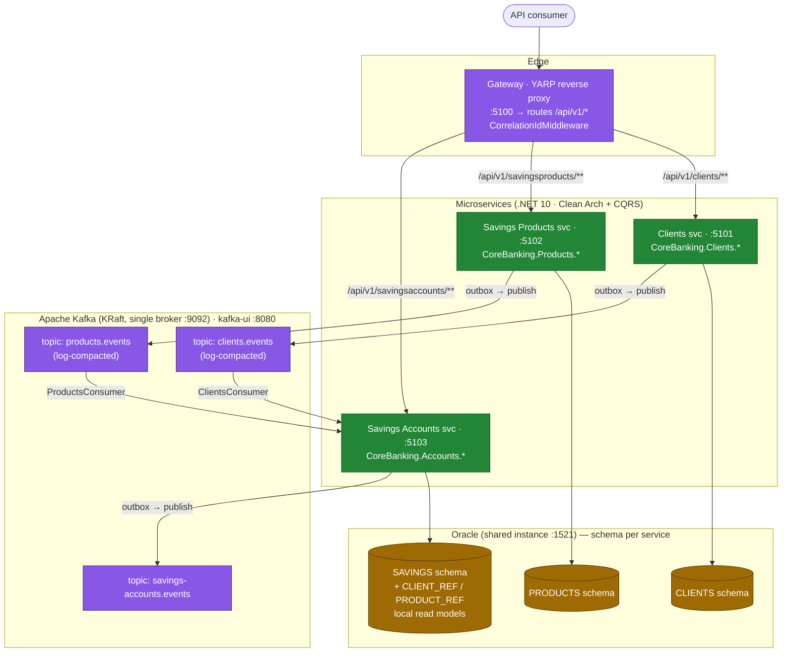
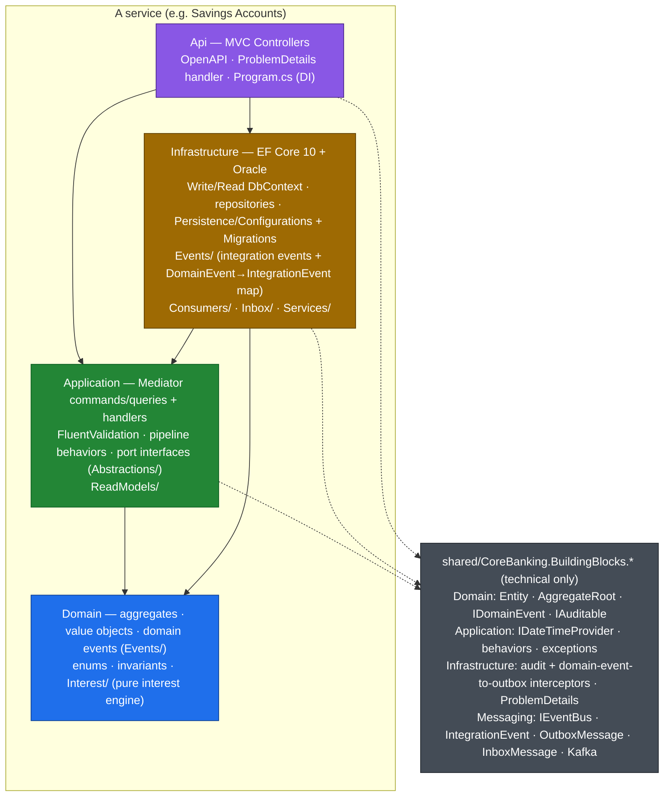
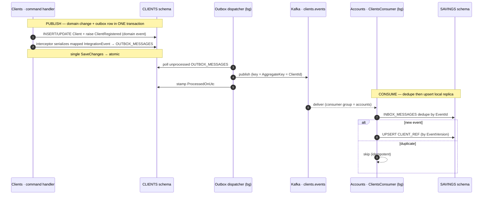
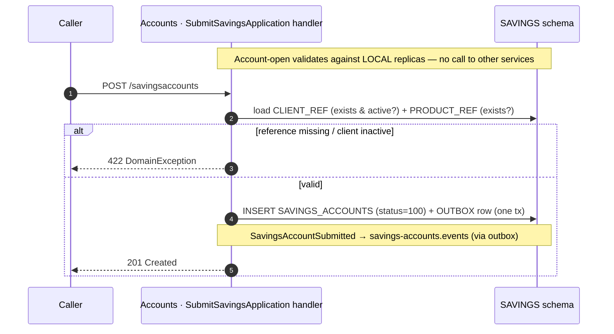
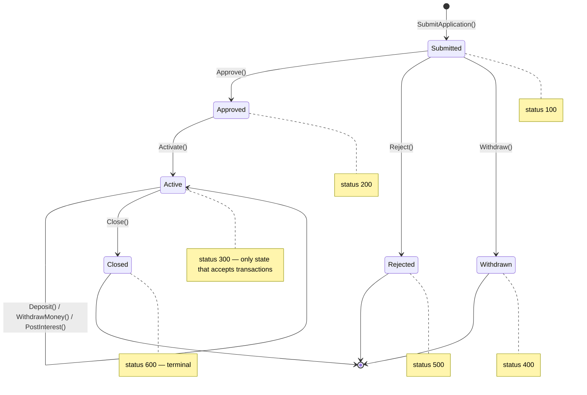
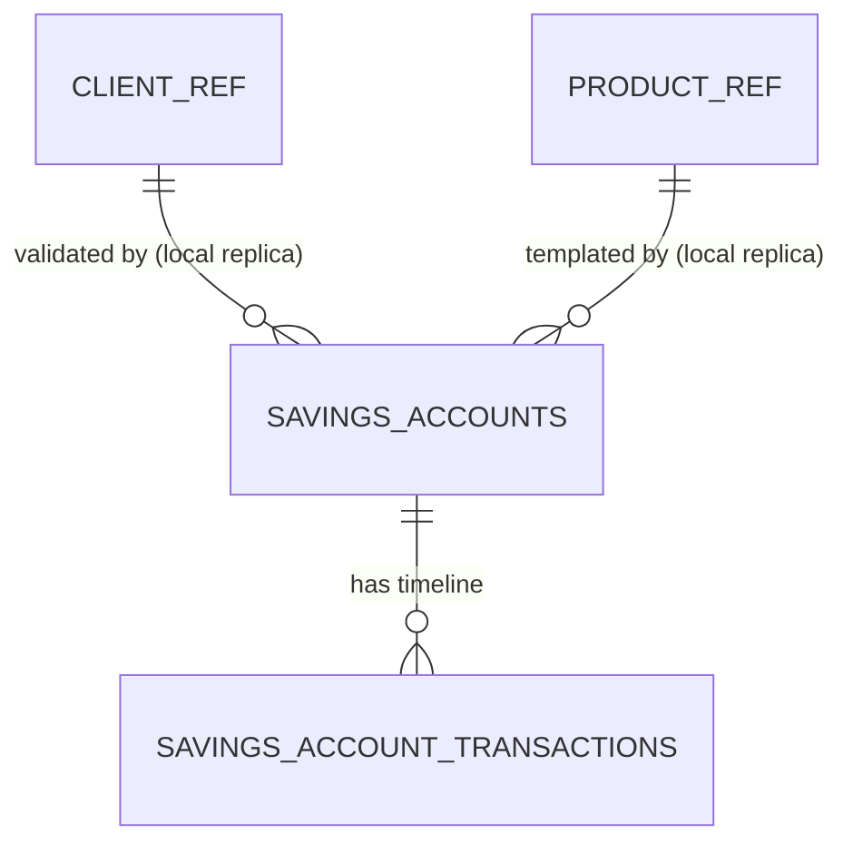
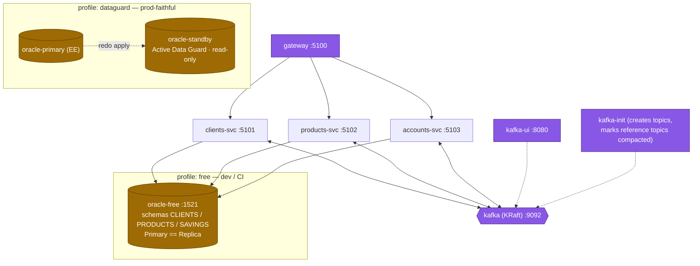

# Architecture — CoreBanking

> **Keep this current.** This document is the source-of-truth map of the running system. **Whenever you add, remove, or change a service** — a new endpoint, a new published/consumed integration event, a new Kafka topic, a schema/table change, a new background consumer, or a routing change at the gateway — **update the relevant diagram and table below in the same change.** A diagram that lies is worse than none.

CoreBanking re-implements Apache Fineract's **savings-account** domain as a .NET 10 microservices platform: three autonomous services behind a YARP gateway, integrating asynchronously over Apache Kafka, each owning its own Oracle schema. Internally every service is Clean Architecture + DDD + CQRS.

Reference: `docs/IMPLEMENTATION_PLAN.md` (design rationale), `docs/EXECUTION_PLAN.md` (build playbook), `CLAUDE.md` (working conventions).

---

## 1. System landscape

**No synchronous service-to-service calls and no cross-schema queries.** Services share state only by publishing integration events; the Accounts service keeps **local replicas** (`CLIENT_REF`, `PRODUCT_REF`) of the reference data it needs, populated by consuming the compacted reference topics.

---

## 2. Service catalogue (actual)

| Service | Namespace root | HTTP | Schema | Publishes → topic | Consumes |
|---|---|---|---|---|---|
| **Clients** | `CoreBanking.Clients` | `:5101` `/api/v1/clients` | `CLIENTS` | `ClientRegistered`, `ClientActivated` → `clients.events` | — |
| **Savings Products** | `CoreBanking.Products` | `:5102` `/api/v1/savingsproducts` | `PRODUCTS` | `SavingsProductCreated` → `products.events` | — |
| **Savings Accounts** | `CoreBanking.Accounts` | `:5103` `/api/v1/savingsaccounts` | `SAVINGS` | `SavingsAccountSubmitted/Approved/Activated/Rejected/Withdrawn/Closed`, `SavingsDeposited`, `SavingsWithdrawn`, `SavingsInterestPosted` → `savings-accounts.events` | `clients.events`, `products.events` |
| **Gateway** | `CoreBanking.Gateway` | `:5100` | — | — | — |

> Directory ≠ namespace: `services/savings-accounts/` → `CoreBanking.Accounts.*`, `services/savings-products/` → `CoreBanking.Products.*`.

### 2.1 Endpoints (actual controllers)

| Method & route (service-local) | Service | Action |
|---|---|---|
| `POST /api/v1/clients` | Clients | Register client |
| `POST /api/v1/clients/{id}/activate` | Clients | Activate client |
| `GET  /api/v1/clients/{id}` | Clients | Get by id |
| `POST /api/v1/savingsproducts` | Products | Create product |
| `GET  /api/v1/savingsproducts/{id}` | Products | Get by id |
| `GET  /api/v1/savingsproducts` | Products | List |
| `POST /api/v1/savingsaccounts` | Accounts | Submit application (201) |
| `POST /api/v1/savingsaccounts/{id}/approve` | Accounts | Approve |
| `POST /api/v1/savingsaccounts/{id}/activate` | Accounts | Activate |
| `POST /api/v1/savingsaccounts/{id}/reject` | Accounts | Reject |
| `POST /api/v1/savingsaccounts/{id}/withdraw` | Accounts | Withdraw application |
| `POST /api/v1/savingsaccounts/{id}/close` | Accounts | Close account |
| `POST /api/v1/savingsaccounts/{id}/transactions/deposit` | Accounts | Deposit money |
| `POST /api/v1/savingsaccounts/{id}/transactions/withdraw` | Accounts | Withdraw money |
| `POST /api/v1/savingsaccounts/{id}/postinterest` | Accounts | Post interest (idempotent) |
| `GET  /api/v1/savingsaccounts/{id}/transactions` | Accounts | List transactions |
| `GET  /api/v1/savingsaccounts/{id}` | Accounts | Get by id |

The gateway forwards `/api/v1/<segment>/{**catch-all}` to the matching cluster (`clients-cluster`→5101, `products-cluster`→5102, `accounts-cluster`→5103) defined in `gateway/CoreBanking.Gateway/appsettings.json`.

---

## 3. Per-service internal architecture (Clean Architecture)

Every service has the same four-project shape; **dependencies point inward only and the rule is enforced by `*.ArchTests` (NetArchTest)**.

**Dependency rule:** Domain → nothing · Application → Domain · Infrastructure → Application + Domain · Api → all. `BuildingBlocks.*` carry **technical concerns only** (no business logic) so services stay autonomous.

**Request pipeline** (`Program.cs` registers Mediator with ordered behaviors): `LoggingBehavior` → `ValidationBehavior` (FluentValidation; failures → 400). Commands use the Write DbContext (primary, change-tracking); queries use the Read DbContext (replica, `NoTracking`). Exceptions map to RFC 7807 via `ExceptionToProblemDetailsHandler`: validation→400, domain→422, not-found→404, concurrency (`Version` token)→409.

---

## 4. Eventing: outbox → Kafka → inbox → read model

The mechanism that makes the services autonomous. Two halves: **publish** (transactional outbox) and **consume** (idempotent inbox + local read model).

Implementation notes (actual):
- **Domain → integration event mapping** is a `switch` named `DomainEventToIntegrationEventMap` in each Infrastructure project's `DependencyInjection.cs`. **Adding a published event is a 3-part change:** raise the domain event (Domain `Events/`), declare the integration event (Clients/Products in their `*.Contracts` project; Accounts in `Infrastructure/Events/`), add a `case` to the map.
- Each `IntegrationEvent` declares its own `Topic` and `AggregateKey` (the partition key — always the aggregate id, preserving per-entity ordering).
- The Accounts consumers are **custom `BackgroundService`s** (`Infrastructure/Consumers/ClientsConsumer`, `ProductsConsumer`), registered via `AddHostedService`. They read the `type` header, dedupe through `IInboxService` (`INBOX_MESSAGES`), and upsert `CLIENT_REF`/`PRODUCT_REF` guarded by `EventVersion` (older/out-of-order events ignored).
- `clients.events` and `products.events` are **log-compacted** and keyed by entity id, so a wiped or brand-new read model re-materialises by replaying from offset 0 — no snapshot/republish needed. `savings-accounts.events` is a normal (non-compacted) event stream.
- Kafka transport lives in `BuildingBlocks.Messaging/Kafka` (`KafkaEventBus : IEventBus`, `KafkaConsumerBackgroundService`, `KafkaOptions` bound from config section `Kafka`).

---

## 5. Savings Account lifecycle (aggregate state machine)

The `SavingsAccount` aggregate (`CoreBanking.Accounts.Domain`) — Fineract-faithful status codes. Each transition guards the source state, mutates, and raises a domain event; illegal transitions throw a `DomainException` → HTTP 422.

**Transactions & interest** (only while `Active`):
- `Deposit` (type 1), `WithdrawMoney` (type 2), `PostInterest` (type 3) operate on a running-balance timeline ordered by `(TransactionDate, Sequence)` — `Sequence` is an explicit per-account counter that breaks same-day ties deterministically.
- Withdrawals are validated against the **full timeline**: the balance may never go negative at any point (including for backdated entries) → `account.balance.insufficient`.
- Interest uses the **daily-balance** method, all in `decimal` (no `Math.Pow`): daily or monthly compounding, calendar posting periods (monthly/quarterly/biannual/annual), 360/365 day-count, `AwayFromZero` rounding applied only when a posting transaction is created. The pure engine is in `Domain/Interest/` (`PostingPeriodCalculator`, `InterestEngine`, `InterestCalculator`).
- **Forward-only** posting via the `InterestPostedTillDate` pivot: posted periods are immutable; any transaction dated on/before the pivot is rejected (`account.transaction.beforepivot`). Re-running `PostInterest` for the same date is idempotent.

**Closure** (`Active → Closed`, status 600 — terminal): `Close(closedOn, withdrawBalance, today)` validates the close date (not future, not before activation, not before the last transaction), requires a **zero balance** (`account.close.balance.nonzero`), and — when `withdrawBalance=true` — first sweeps the remaining balance to zero with a **pivot-exempt** settle-withdrawal dated `closedOn` (it shares `InsertWithdrawalUnchecked` with `WithdrawMoney` but raises no `SavingsWithdrawn`; the final balance rides on `SavingsAccountClosed.BalanceAfter`). Raises `SavingsAccountClosed`. A `Closed` account is terminal — no further transitions or transactions.

Domain methods take `today`/dates as parameters (clock-free); handlers supply them from `IDateTimeProvider`.

---

## 6. Persistence — schema per service

Each service owns one Oracle schema with `HasDefaultSchema(...)`; **no cross-service foreign keys**. The Accounts schema additionally holds the local read-model tables and the inbox.

| Schema | Tables (actual) |
|---|---|
| `CLIENTS` | `CLIENTS`, `OUTBOX_MESSAGES` |
| `PRODUCTS` | `SAVINGS_PRODUCTS`, `OUTBOX_MESSAGES` |
| `SAVINGS` | `SAVINGS_ACCOUNTS`, `SAVINGS_ACCOUNT_TRANSACTIONS`, `CLIENT_REF`, `PRODUCT_REF`, `INBOX_MESSAGES`, `OUTBOX_MESSAGES` |

- Each service has a **Write** DbContext (primary, owns migrations) and a **Read** DbContext (replica, `NoTracking`): `ClientsWriteDbContext`/`ClientsReadDbContext`, `SavingsProductsWriteDbContext`/`SavingsProductsReadDbContext`, `SavingsAccountsWriteDbContext`/`SavingsAccountsReadDbContext`. Connection strings: `ConnectionStrings:Primary` / `ConnectionStrings:Replica` (identical on the `free` profile).
- Migrations live under each Infrastructure project's `Persistence/Migrations/`. See `CLAUDE.md` for the `dotnet ef migrations add` invocation.
- Oracle conventions: money/rates `NUMBER(19,6)`, enums `NUMBER`, GUID keys `RAW(16)` (sequential v7 GUIDs), optimistic concurrency via a `Version` token → 409.
- `SAVINGS_ACCOUNTS` carries the lifecycle dates (`APPROVEDON`, `ACTIVATEDON`, `REJECTEDON`, `WITHDRAWNON`, and the closure date `CLOSEDON`) as nullable `NVARCHAR2(10)` (`DateOnly`).

---

## 7. Deployment topology (Docker Compose)

- **`free`** profile (default for dev/CI): one `gvenzl/oracle-free` instance holds all three schemas; read==write. Fast.
- **`dataguard`** profile: Oracle Enterprise primary + Active Data Guard standby; each service's Replica points at the standby. (Oracle 23ai *Free* cannot do Data Guard — the physical read split exists only here.)
- Kafka is a single-node KRaft broker (`apache/kafka`), no ZooKeeper; `kafka-init` bootstraps topics and marks the reference topics compacted; `kafka-ui` (kafbat) at `:8080`.

Run: `cd docker && docker compose --profile free up` (see `CLAUDE.md`).

---

## 8. Testing & quality gates

| Layer | Project(s) | What it covers |
|---|---|---|
| Unit | `*.UnitTests` (per service) + `BuildingBlocks.UnitTests` | domain invariants/lifecycle, interest math, handlers, consumers (mocked ports via NSubstitute) |
| Architecture | `*.ArchTests` (per service) | the inward dependency rule (NetArchTest) |
| Integration | `*.IntegrationTests` (per service) + Gateway + BuildingBlocks | Testcontainers Oracle/Kafka: migrations, command→DB→query round-trip, outbox/inbox |
| Contract | `tests/CoreBanking.ContractTests` | published integration-event schemas match consumer expectations across services |

Integration tests require a running Docker daemon (Testcontainers). CI (`.github/workflows/ci.yml`) builds `CoreBanking.slnx` in Release and runs `--filter "Category!=Integration"`.

---

## Change checklist (do this when the architecture changes)

When you add/change a service or its boundaries, update **this file** plus the code:
- [ ] New/changed **endpoint** → §2.1 table (+ gateway route in §2 if a new path segment).
- [ ] New **published** integration event → §2 table, §4 notes, and the `DomainEventToIntegrationEventMap` in that service's Infrastructure DI.
- [ ] New **consumed** event / new **consumer** → §1 diagram, §2 table, §4.
- [ ] New **Kafka topic** → §1 diagram + §2 table (note compacted vs stream).
- [ ] **Schema/table** change → §6 table/ER + a new EF migration.
- [ ] **New service** → §1 landscape, §2 catalogue, §3 (note any deviation), §6, §7, and a row in §8.
