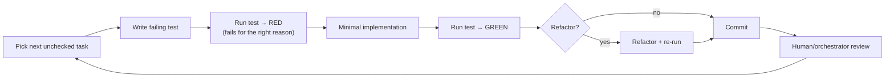
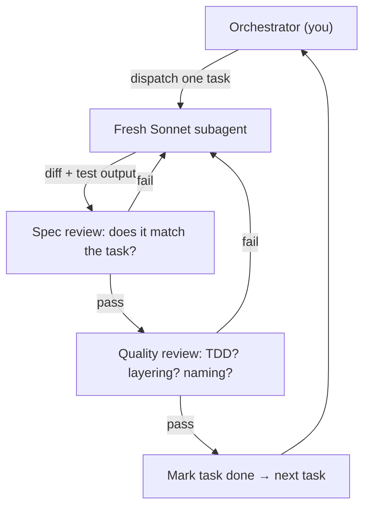
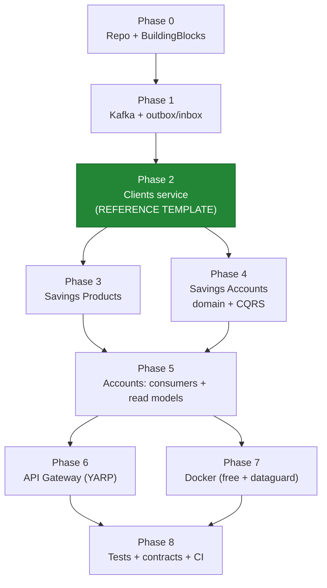

# CoreBanking Execution Plan

> **For agentic workers:** REQUIRED SUB-SKILL: Use `superpowers:subagent-driven-development` (recommended) or `superpowers:executing-plans` to implement this plan task-by-task. Steps use checkbox (`- [ ]`) syntax for tracking. This document is the build playbook derived from [`IMPLEMENTATION_PLAN.md`](./IMPLEMENTATION_PLAN.md) (the design). Read the design first; this plan tells you *how to build it*.

**Goal:** Build a .NET 10 microservices platform that re-creates Fineract's savings-account lifecycle (Clients, Savings Products, Savings Accounts services) behind a YARP gateway, with Oracle (schema-per-service, read/write split) and Apache Kafka (event-driven reference replication + local read models).

**Architecture:** Three autonomous services, each internally DDD + Clean Architecture + CQRS; shared `BuildingBlocks.*` for technical concerns; transactional outbox/inbox over Kafka; EF Core 10 on Oracle.

**Tech Stack:** .NET 10 / C# 14 · `martinothamar/Mediator` 3.0 (MIT) · FluentValidation · EF Core 10 + `Oracle.EntityFrameworkCore` 10.23.x · `Confluent.Kafka` · YARP · Polly · xUnit + FluentAssertions + NSubstitute + Testcontainers + NetArchTest.

---

## §0. Adviser notes — how the Claude Sonnet execution agent must work

You (the Sonnet execution agent) are a skilled developer who knows **nothing** about this codebase and has questionable taste. Follow these rules exactly; they are not optional.

### Operating rules
1. **TDD always.** Red → Green → Refactor. Write the failing test first, watch it fail for the *right reason*, write the minimal code, watch it pass, refactor, commit. Never write implementation before a failing test.
2. **One task at a time.** Each task below is self-contained. Finish it (all steps green + committed) before starting the next. Do not skip ahead.
3. **Verify before claiming done.** Run the exact command shown and confirm the exact expected output. Never say "done" without the command output proving it. (Use `superpowers:verification-before-completion`.)
4. **Commit frequently.** One commit per task minimum, using the message shown. Work on a branch (`git switch -c feat/corebanking-<phase>`), never commit straight to `main`/`develop`.
5. **No placeholders in code.** No `TODO`, no "add error handling later". If a step shows code, type that code.
6. **Stay in the layer.** Domain references nothing. Application references Domain. Infrastructure references Application+Domain. Api references all. If you're tempted to break this, STOP — you've misread the task.
7. **When stuck or ambiguous, STOP and ask the human.** Do not invent requirements. Specifically stop if: a verified API differs from the plan, a test can't be made to pass in ~15 min, or an Oracle/Kafka container won't start.
8. **Confirm fast-moving APIs.** The plan pins versions and shows real APIs, but `Oracle.EntityFrameworkCore` and `Confluent.Kafka` evolve — if a symbol doesn't resolve, check current docs (Context7) before improvising.

### The per-task loop



### Recommended orchestration (advice to whoever drives this agent)



Dispatch a **fresh subagent per task** so context stays small and focused; review the diff + test output between tasks. Phases must run in order; within a phase, tasks are sequential unless noted "parallel-safe".

---

## §1. Global conventions

### Solution layout (created in Phase 0)
See [`IMPLEMENTATION_PLAN.md` §6](./IMPLEMENTATION_PLAN.md) for the full tree. Roots: `shared/`, `services/{clients,savings-products,savings-accounts}/`, `gateway/`, `tests/`, `docker/`.

### Naming
- Projects: `CoreBanking.<Area>.<Layer>` (e.g. `CoreBanking.Clients.Domain`).
- Namespaces follow folder paths. Tables: PascalCase plural (`Clients`, `SavingsAccounts`). Enums stored as `NUMBER(5)`.
- One public type per file. Files ≤ ~300 lines; split when larger.

### Error model (shared)
- `ValidationException` → HTTP 400 (RFC 7807 ProblemDetails, `errors` dictionary).
- `DomainException` (illegal state transition / invariant) → 422.
- `NotFoundException` → 404.
- `DbUpdateConcurrencyException` → 409.

### Test conventions
- **Domain/Application tests:** fast, no I/O, no containers. xUnit + FluentAssertions; mock ports with NSubstitute.
- **Integration tests:** Testcontainers (Oracle Free / Kafka). Marked `[Trait("Category","Integration")]`; excluded from the fast loop.
- Test naming: `MethodOrScenario_Condition_ExpectedResult`.

### `global.json` (pin SDK)
```json
{ "sdk": { "version": "10.0.100", "rollForward": "latestFeature" } }
```

### `Directory.Build.props` (repo root)
```xml
<Project>
  <PropertyGroup>
    <TargetFramework>net10.0</TargetFramework>
    <LangVersion>latest</LangVersion>
    <Nullable>enable</Nullable>
    <ImplicitUsings>enable</ImplicitUsings>
    <TreatWarningsAsErrors>true</TreatWarningsAsErrors>
    <EnforceCodeStyleInBuild>true</EnforceCodeStyleInBuild>
  </PropertyGroup>
</Project>
```

### `Directory.Packages.props` (central package management — pin once, reference everywhere)
```xml
<Project>
  <PropertyGroup><ManagePackageVersionsCentrally>true</ManagePackageVersionsCentrally></PropertyGroup>
  <ItemGroup>
    <PackageVersion Include="Mediator.Abstractions" Version="3.0.*" />
    <PackageVersion Include="Mediator.SourceGenerator" Version="3.0.*" />
    <PackageVersion Include="FluentValidation" Version="11.*" />
    <PackageVersion Include="FluentValidation.DependencyInjectionExtensions" Version="11.*" />
    <PackageVersion Include="Microsoft.EntityFrameworkCore" Version="10.0.*" />
    <PackageVersion Include="Microsoft.EntityFrameworkCore.Design" Version="10.0.*" />
    <PackageVersion Include="Oracle.EntityFrameworkCore" Version="10.23.*" />
    <PackageVersion Include="Confluent.Kafka" Version="2.*" />
    <PackageVersion Include="Yarp.ReverseProxy" Version="2.*" />
    <PackageVersion Include="Polly" Version="8.*" />
    <PackageVersion Include="Serilog.AspNetCore" Version="8.*" />
    <PackageVersion Include="Microsoft.AspNetCore.OpenApi" Version="10.0.*" />
    <PackageVersion Include="xunit" Version="2.*" />
    <PackageVersion Include="xunit.runner.visualstudio" Version="2.*" />
    <PackageVersion Include="Microsoft.NET.Test.Sdk" Version="17.*" />
    <PackageVersion Include="FluentAssertions" Version="6.*" />
    <PackageVersion Include="NSubstitute" Version="5.*" />
    <PackageVersion Include="NetArchTest.Rules" Version="1.*" />
    <PackageVersion Include="Testcontainers.Oracle" Version="3.*" />
    <PackageVersion Include="Testcontainers.Kafka" Version="3.*" />
  </ItemGroup>
</Project>
```

> Versions with `*` resolve to the latest patch at restore time; if a major has moved, confirm and pin exactly. `martinothamar/Mediator` and `Oracle.EntityFrameworkCore` are the two to double-check.

---

## §2. Execution roadmap & dependencies



**Phase 2 (Clients) is the reference vertical slice — build it in full TDD detail. Phases 3–5 replicate its pattern with the service-specific specifics enumerated here.** After Phase 2, Phases 3 and 4 are parallel-safe (different services).

> **Scope note (per `writing-plans`):** this platform spans multiple subsystems. Phases 0–2 below are fully task-decomposed with real code. Phases 3–8 give concrete file lists, the exact domain/event/endpoint specifics, key novel code, and acceptance criteria, and instruct you to **apply the Phase 2 template**. If you want any later phase expanded into full per-task TDD steps, ask the human to generate that sub-plan — do not improvise it loosely.

---

## Phase 0 — Repository & BuildingBlocks

**Outcome:** a building solution with the shared technical kernel, fully unit-tested.

### Task 0.1: Create the solution skeleton

**Files:** create solution + `Directory.*.props` + `global.json` (contents in §1).

- [ ] **Step 1: Create branch and files**
```bash
cd /Users/mac/Documents/Projects/CoreBanking
git init
git switch -c feat/corebanking-phase0
dotnet new sln -n CoreBanking
# add the three props/json files from §1 here (Directory.Build.props, Directory.Packages.props, global.json)
```
- [ ] **Step 2: Create BuildingBlocks projects**
```bash
dotnet new classlib -n CoreBanking.BuildingBlocks.Domain -o shared/CoreBanking.BuildingBlocks.Domain
dotnet new classlib -n CoreBanking.BuildingBlocks.Application -o shared/CoreBanking.BuildingBlocks.Application
dotnet new classlib -n CoreBanking.BuildingBlocks.Infrastructure -o shared/CoreBanking.BuildingBlocks.Infrastructure
dotnet new classlib -n CoreBanking.BuildingBlocks.Messaging -o shared/CoreBanking.BuildingBlocks.Messaging
dotnet new xunit -n CoreBanking.BuildingBlocks.UnitTests -o shared/tests/CoreBanking.BuildingBlocks.UnitTests
dotnet sln add (Get-ChildItem -r *.csproj)   # pwsh; or: find . -name *.csproj -exec dotnet sln add {} +
```
- [ ] **Step 3: Wire references**
```bash
dotnet add shared/CoreBanking.BuildingBlocks.Application reference shared/CoreBanking.BuildingBlocks.Domain
dotnet add shared/CoreBanking.BuildingBlocks.Infrastructure reference shared/CoreBanking.BuildingBlocks.Application
dotnet add shared/CoreBanking.BuildingBlocks.Messaging reference shared/CoreBanking.BuildingBlocks.Application
dotnet add shared/tests/CoreBanking.BuildingBlocks.UnitTests reference shared/CoreBanking.BuildingBlocks.Domain
```
- [ ] **Step 4: Verify build** — Run: `dotnet build`. Expected: `Build succeeded. 0 Warning(s) 0 Error(s)`.
- [ ] **Step 5: Commit** — `git add -A && git commit -m "chore: scaffold solution + BuildingBlocks projects"`

### Task 0.2: `Entity` and `AggregateRoot` base types (TDD)

**Files:** Create `shared/CoreBanking.BuildingBlocks.Domain/Entity.cs`, `AggregateRoot.cs`, `IDomainEvent.cs`; Test `shared/tests/CoreBanking.BuildingBlocks.UnitTests/AggregateRootTests.cs`.

- [ ] **Step 1: Write the failing test**
```csharp
using CoreBanking.BuildingBlocks.Domain;
using FluentAssertions;
using Xunit;

public sealed class AggregateRootTests
{
    private sealed record SampleEvent(Guid Id) : IDomainEvent;
    private sealed class Sample : AggregateRoot
    {
        public Sample(Guid id) : base(id) { }
        public void Do() => Raise(new SampleEvent(Id));
    }

    [Fact]
    public void Raise_buffers_event_until_cleared()
    {
        var a = new Sample(Guid.CreateVersion7());
        a.Do();
        a.DomainEvents.Should().ContainSingle();
        a.ClearDomainEvents();
        a.DomainEvents.Should().BeEmpty();
    }

    [Fact]
    public void Entities_with_same_id_are_equal()
    {
        var id = Guid.CreateVersion7();
        new Sample(id).Should().Be(new Sample(id));
    }
}
```
- [ ] **Step 2: Run → RED** — Run: `dotnet test shared/tests/CoreBanking.BuildingBlocks.UnitTests`. Expected: FAIL (types `AggregateRoot`/`IDomainEvent` not found).
- [ ] **Step 3: Implement**
```csharp
// IDomainEvent.cs
namespace CoreBanking.BuildingBlocks.Domain;
public interface IDomainEvent { }

// Entity.cs
namespace CoreBanking.BuildingBlocks.Domain;
public abstract class Entity
{
    public Guid Id { get; protected init; }
    protected Entity(Guid id) => Id = id;
    public override bool Equals(object? obj) => obj is Entity e && e.GetType() == GetType() && e.Id == Id;
    public override int GetHashCode() => Id.GetHashCode();
}

// AggregateRoot.cs
namespace CoreBanking.BuildingBlocks.Domain;
public abstract class AggregateRoot : Entity
{
    private readonly List<IDomainEvent> _domainEvents = new();
    protected AggregateRoot(Guid id) : base(id) { }
    public IReadOnlyList<IDomainEvent> DomainEvents => _domainEvents.AsReadOnly();
    protected void Raise(IDomainEvent e) => _domainEvents.Add(e);
    public void ClearDomainEvents() => _domainEvents.Clear();
    public int Version { get; private set; }
}
```
- [ ] **Step 4: Run → GREEN** — Run: `dotnet test shared/tests/CoreBanking.BuildingBlocks.UnitTests`. Expected: PASS (2 tests).
- [ ] **Step 5: Commit** — `git commit -am "feat(bb): Entity + AggregateRoot with domain-event buffer"`

### Task 0.3: `AuditableEntity`, exceptions, `ValueObject` helper

**Files:** Create `AuditableEntity.cs`, `Exceptions/DomainException.cs`, `Exceptions/NotFoundException.cs` in Domain; `Exceptions/ValidationException.cs` in Application.

- [ ] **Step 1: Test (DomainException carries a code)**
```csharp
[Fact] public void DomainException_exposes_message()
    => new DomainException("savings.invalid.state", "bad").Message.Should().Be("bad");
```
- [ ] **Step 2: Run → RED.** Expected: FAIL (type not found).
- [ ] **Step 3: Implement**
```csharp
// Domain/AuditableEntity.cs  — mixin via interface (single inheritance already used for AggregateRoot)
namespace CoreBanking.BuildingBlocks.Domain;
public interface IAuditable
{
    DateTimeOffset CreatedOnUtc { get; set; }
    string? CreatedBy { get; set; }
    DateTimeOffset? LastModifiedOnUtc { get; set; }
    string? LastModifiedBy { get; set; }
}

// Domain/Exceptions/DomainException.cs
namespace CoreBanking.BuildingBlocks.Domain;
public class DomainException(string code, string message) : Exception(message)
{ public string Code { get; } = code; }

// Domain/Exceptions/NotFoundException.cs
namespace CoreBanking.BuildingBlocks.Domain;
public sealed class NotFoundException(string name, object key)
    : Exception($"{name} '{key}' was not found.");

// Application/Exceptions/ValidationException.cs
namespace CoreBanking.BuildingBlocks.Application;
public sealed class ValidationException(IDictionary<string, string[]> errors)
    : Exception("Validation failed") { public IDictionary<string, string[]> Errors { get; } = errors; }
```
- [ ] **Step 4: Run → GREEN.** - [ ] **Step 5: Commit** — `git commit -am "feat(bb): auditable interface + domain/validation exceptions"`

### Task 0.4: CQRS markers + `ValidationBehavior` (Mediator pipeline) — TDD

**Files:** Application `Abstractions/ICurrentUser.cs`, `Abstractions/IDateTimeProvider.cs`, `Behaviors/ValidationBehavior.cs`, `Behaviors/LoggingBehavior.cs`; Test `ValidationBehaviorTests.cs`. Add packages to Application: `Mediator.Abstractions`, `FluentValidation`.

- [ ] **Step 1: Failing test**
```csharp
using CoreBanking.BuildingBlocks.Application;
using FluentValidation;
using Mediator;
using Xunit; using FluentAssertions;

public sealed class ValidationBehaviorTests
{
    private sealed record Cmd(string Name) : ICommand<string>;
    private sealed class CmdValidator : AbstractValidator<Cmd>
    { public CmdValidator() => RuleFor(x => x.Name).NotEmpty(); }

    [Fact]
    public async Task Throws_ValidationException_when_invalid()
    {
        var behavior = new ValidationBehavior<Cmd, string>(new[] { new CmdValidator() });
        MessageHandlerDelegate<Cmd, string> next = (_, _) => new ValueTask<string>("ok");
        var act = async () => await behavior.Handle(new Cmd(""), next, default);
        await act.Should().ThrowAsync<ValidationException>();
    }

    [Fact]
    public async Task Calls_next_when_valid()
    {
        var behavior = new ValidationBehavior<Cmd, string>(new[] { new CmdValidator() });
        MessageHandlerDelegate<Cmd, string> next = (_, _) => new ValueTask<string>("ok");
        (await behavior.Handle(new Cmd("a"), next, default)).Should().Be("ok");
    }
}
```
- [ ] **Step 2: Run → RED.** Expected: FAIL (`ValidationBehavior` not found).
- [ ] **Step 3: Implement (note the verified Mediator v3 signature)**
```csharp
// Behaviors/ValidationBehavior.cs
using FluentValidation;
using Mediator;

namespace CoreBanking.BuildingBlocks.Application;

public sealed class ValidationBehavior<TMessage, TResponse>(IEnumerable<IValidator<TMessage>> validators)
    : IPipelineBehavior<TMessage, TResponse> where TMessage : notnull, IMessage
{
    public async ValueTask<TResponse> Handle(TMessage message,
        MessageHandlerDelegate<TMessage, TResponse> next, CancellationToken ct)
    {
        if (validators.Any())
        {
            var ctx = new ValidationContext<TMessage>(message);
            var failures = validators
                .Select(v => v.Validate(ctx))
                .SelectMany(r => r.Errors)
                .Where(f => f is not null)
                .ToList();
            if (failures.Count != 0)
            {
                var errors = failures
                    .GroupBy(f => f.PropertyName)
                    .ToDictionary(g => g.Key, g => g.Select(f => f.ErrorMessage).ToArray());
                throw new ValidationException(errors);
            }
        }
        return await next(message, ct);
    }
}
```
```csharp
// Behaviors/LoggingBehavior.cs  (verified v3 shape)
using Mediator; using Microsoft.Extensions.Logging;
namespace CoreBanking.BuildingBlocks.Application;
public sealed class LoggingBehavior<TMessage, TResponse>(ILogger<LoggingBehavior<TMessage, TResponse>> logger)
    : IPipelineBehavior<TMessage, TResponse> where TMessage : notnull, IMessage
{
    public async ValueTask<TResponse> Handle(TMessage message,
        MessageHandlerDelegate<TMessage, TResponse> next, CancellationToken ct)
    {
        logger.LogInformation("Handling {Message}", typeof(TMessage).Name);
        var response = await next(message, ct);
        logger.LogInformation("Handled {Message}", typeof(TMessage).Name);
        return response;
    }
}
```
- [ ] **Step 4: Run → GREEN** (2 tests). - [ ] **Step 5: Commit** — `git commit -am "feat(bb): validation + logging Mediator pipeline behaviors"`

### Task 0.5: Outbox/Inbox entities + `IEventBus` + `IntegrationEvent` (Messaging)

**Files:** Messaging `IntegrationEvent.cs`, `IEventBus.cs`, `OutboxMessage.cs`, `InboxMessage.cs`. Domain test optional (POCOs). No DB yet.

- [ ] **Step 1: Implement (POCO contracts — covered by Phase 1 integration tests)**
```csharp
// IntegrationEvent.cs
namespace CoreBanking.BuildingBlocks.Messaging;
public abstract record IntegrationEvent(Guid EventId, DateTimeOffset OccurredOnUtc, long Version)
{ public abstract string Topic { get; } public abstract string AggregateKey { get; } }

// IEventBus.cs
namespace CoreBanking.BuildingBlocks.Messaging;
public interface IEventBus { Task PublishAsync(IntegrationEvent @event, CancellationToken ct = default); }

// OutboxMessage.cs
namespace CoreBanking.BuildingBlocks.Messaging;
public sealed class OutboxMessage
{
    public Guid Id { get; set; }
    public string Type { get; set; } = default!;
    public string Topic { get; set; } = default!;
    public string AggregateKey { get; set; } = default!;
    public string Content { get; set; } = default!;   // JSON
    public DateTimeOffset OccurredOnUtc { get; set; }
    public DateTimeOffset? ProcessedOnUtc { get; set; }
    public string? Error { get; set; }
}

// InboxMessage.cs
namespace CoreBanking.BuildingBlocks.Messaging;
public sealed class InboxMessage
{
    public Guid EventId { get; set; }      // idempotency key
    public string Type { get; set; } = default!;
    public DateTimeOffset ReceivedOnUtc { get; set; }
    public DateTimeOffset? ProcessedOnUtc { get; set; }
}
```
- [ ] **Step 2: Build** — Run: `dotnet build`. Expected: success. - [ ] **Step 3: Commit** — `git commit -am "feat(bb): integration-event + outbox/inbox contracts"`

### Task 0.6: EF SaveChanges interceptors (audit + version + outbox)

**Files:** Infrastructure `Interceptors/AuditableEntityInterceptor.cs`, `Interceptors/ConvertDomainEventsToOutboxInterceptor.cs`. Add `Microsoft.EntityFrameworkCore` to Infrastructure. (Behavior is exercised by Phase 2 integration tests.)

- [ ] **Step 1: Implement**
```csharp
// AuditableEntityInterceptor.cs — stamps audit fields + bumps AggregateRoot.Version
using CoreBanking.BuildingBlocks.Application;     // ICurrentUser, IDateTimeProvider
using CoreBanking.BuildingBlocks.Domain;
using Microsoft.EntityFrameworkCore;
using Microsoft.EntityFrameworkCore.Diagnostics;

namespace CoreBanking.BuildingBlocks.Infrastructure;

public sealed class AuditableEntityInterceptor(ICurrentUser user, IDateTimeProvider clock)
    : SaveChangesInterceptor
{
    public override ValueTask<InterceptionResult<int>> SavingChangesAsync(
        DbContextEventData data, InterceptionResult<int> result, CancellationToken ct = default)
    {
        var ctx = data.Context;
        if (ctx is not null)
            foreach (var entry in ctx.ChangeTracker.Entries<IAuditable>())
            {
                if (entry.State == EntityState.Added)
                { entry.Entity.CreatedOnUtc = clock.UtcNow; entry.Entity.CreatedBy = user.UserId; }
                if (entry.State is EntityState.Added or EntityState.Modified)
                { entry.Entity.LastModifiedOnUtc = clock.UtcNow; entry.Entity.LastModifiedBy = user.UserId; }
            }
        return base.SavingChangesAsync(data, result, ct);
    }
}
```
```csharp
// ConvertDomainEventsToOutboxInterceptor.cs — turns buffered domain events into OUTBOX rows
using System.Text.Json;
using CoreBanking.BuildingBlocks.Domain;
using CoreBanking.BuildingBlocks.Messaging;
using Microsoft.EntityFrameworkCore;
using Microsoft.EntityFrameworkCore.Diagnostics;

namespace CoreBanking.BuildingBlocks.Infrastructure;

public sealed class ConvertDomainEventsToOutboxInterceptor(IDateTimeProvider clock,
    Func<IDomainEvent, IntegrationEvent?> map) : SaveChangesInterceptor
{
    public override ValueTask<InterceptionResult<int>> SavingChangesAsync(
        DbContextEventData data, InterceptionResult<int> result, CancellationToken ct = default)
    {
        var ctx = data.Context;
        if (ctx is not null)
        {
            var roots = ctx.ChangeTracker.Entries<AggregateRoot>().Select(e => e.Entity).ToList();
            foreach (var root in roots)
            {
                foreach (var de in root.DomainEvents)
                {
                    var ie = map(de);
                    if (ie is null) continue;
                    ctx.Set<OutboxMessage>().Add(new OutboxMessage
                    {
                        Id = ie.EventId, Type = ie.GetType().Name, Topic = ie.Topic,
                        AggregateKey = ie.AggregateKey, OccurredOnUtc = ie.OccurredOnUtc,
                        Content = JsonSerializer.Serialize(ie, ie.GetType())
                    });
                }
                root.ClearDomainEvents();
            }
        }
        return base.SavingChangesAsync(data, result, ct);
    }
}
```
> `ICurrentUser { string? UserId }` and `IDateTimeProvider { DateTimeOffset UtcNow }` live in Application (Task 0.4 created the files — add the members now). The `map` delegate is supplied per service to translate its own domain events to integration events.
- [ ] **Step 2: Build → success.** - [ ] **Step 3: Commit** — `git commit -am "feat(bb): audit + domain-events-to-outbox interceptors"`

### Phase 0 acceptance
- [ ] `dotnet build` clean; `dotnet test` green (BuildingBlocks.UnitTests). Merge `feat/corebanking-phase0`.

---

## Phase 1 — Kafka transport + outbox dispatcher + inbox

**Outcome:** reliable publish (outbox→Kafka) and idempotent consume (inbox), proven by a Testcontainers round-trip + a replay test.

### Task 1.1: `KafkaEventBus` (Confluent.Kafka producer)
**Files:** Messaging `Kafka/KafkaEventBus.cs`, `Kafka/KafkaOptions.cs`. Add `Confluent.Kafka`.
```csharp
// KafkaOptions.cs
namespace CoreBanking.BuildingBlocks.Messaging.Kafka;
public sealed class KafkaOptions { public string BootstrapServers { get; set; } = "localhost:9092"; }

// KafkaEventBus.cs
using System.Text.Json; using Confluent.Kafka; using Microsoft.Extensions.Options;
namespace CoreBanking.BuildingBlocks.Messaging.Kafka;
public sealed class KafkaEventBus : IEventBus, IDisposable
{
    private readonly IProducer<string, byte[]> _producer;
    public KafkaEventBus(IOptions<KafkaOptions> o) =>
        _producer = new ProducerBuilder<string, byte[]>(new ProducerConfig
        { BootstrapServers = o.Value.BootstrapServers, EnableIdempotence = true, Acks = Acks.All }).Build();
    public async Task PublishAsync(IntegrationEvent e, CancellationToken ct = default)
    {
        var payload = JsonSerializer.SerializeToUtf8Bytes(e, e.GetType());
        var msg = new Message<string, byte[]> { Key = e.AggregateKey, Value = payload,
            Headers = new Headers { { "type", System.Text.Encoding.UTF8.GetBytes(e.GetType().Name) } } };
        await _producer.ProduceAsync(e.Topic, msg, ct);
    }
    public void Dispose() => _producer.Dispose();
}
```
- [ ] TDD: integration test in Task 1.3. Build + commit `feat(bb): Kafka event bus (idempotent producer)`.

### Task 1.2: `OutboxProcessor` background service
**Files:** Infrastructure `Outbox/OutboxProcessor.cs`. Polls unprocessed `OutboxMessage` rows, publishes via `IEventBus`, stamps `ProcessedOnUtc`. Run every ~1s; batch 100; reconstruct the `IntegrationEvent` topic/key from the stored row (publish raw `Content` to `Topic` with `AggregateKey`). Key correctness points to encode:
- Order by `OccurredOnUtc`; process in a transaction; on publish failure write `Error` and leave unprocessed for retry.
- Provide a `PublishRawAsync(topic, key, contentBytes, typeHeader)` on the bus (add overload) so the processor needn't re-deserialize into concrete types.
- [ ] Build + commit `feat(bb): outbox dispatcher background service`.

### Task 1.3: Integration round-trip + replay (Testcontainers Kafka)
**Files:** new test project `shared/tests/CoreBanking.BuildingBlocks.IntegrationTests` (+ `Testcontainers.Kafka`).
- [ ] **Step 1: Failing test** — start a `KafkaContainer`, publish two `SampleIntegrationEvent`s to a compacted topic keyed by the same id, start a consumer group from offset 0, assert it receives them in order; then reset the group offset to 0 and assert a *fresh* consumer re-reads them (replay). Expected first run: RED (no consumer yet).
- [ ] **Step 2: Implement** a `KafkaConsumerBackgroundService<T>` base (ConsumerConfig: `GroupId`, `AutoOffsetReset.Earliest`, `EnableAutoCommit=false`, manual `Commit` after successful handle) + an `IInboxService` that dedupes by `EventId`.
- [ ] **Step 3: GREEN.** Run: `dotnet test ...IntegrationTests --filter Category=Integration`. Expected: PASS (round-trip + replay).
- [ ] **Step 4: Commit** `feat(bb): kafka consumer base + inbox + replay test`.

### Phase 1 acceptance
- [ ] An event published through the outbox is consumed exactly once; offset reset replays it. Merge.

---

## Phase 2 — Clients service (REFERENCE TEMPLATE — full TDD)

**Outcome:** a complete vertical slice. **Every later service copies this shape.**

### Task 2.1: Create projects
```bash
git switch -c feat/corebanking-clients
dotnet new classlib -n CoreBanking.Clients.Domain -o services/clients/CoreBanking.Clients.Domain
dotnet new classlib -n CoreBanking.Clients.Application -o services/clients/CoreBanking.Clients.Application
dotnet new classlib -n CoreBanking.Clients.Infrastructure -o services/clients/CoreBanking.Clients.Infrastructure
dotnet new web      -n CoreBanking.Clients.Api -o services/clients/CoreBanking.Clients.Api
dotnet new xunit    -n CoreBanking.Clients.UnitTests -o services/clients/tests/CoreBanking.Clients.UnitTests
dotnet new xunit    -n CoreBanking.Clients.IntegrationTests -o services/clients/tests/CoreBanking.Clients.IntegrationTests
# add all to sln; wire references Domain<-App<-Infra<-Api and BuildingBlocks.* into each layer; Mediator.SourceGenerator into Application
```
- [ ] Build + commit `chore(clients): scaffold service projects`.

### Task 2.2: `Client` aggregate (TDD)
**Files:** Domain `Client.cs`, `ClientStatus.cs`, `Events/ClientRegistered.cs`, `Events/ClientActivated.cs`; Test `ClientTests.cs`.
- [ ] **Step 1: Failing test**
```csharp
[Fact] public void Register_creates_pending_client_and_raises_event()
{
    var c = Client.Register("Ada Lovelace", externalId: "EXT-1");
    c.Status.Should().Be(ClientStatus.Pending);
    c.DomainEvents.OfType<ClientRegistered>().Should().ContainSingle();
}
[Fact] public void Activate_from_pending_sets_active_and_date()
{
    var c = Client.Register("Ada", null);
    c.Activate(new DateOnly(2026,6,8));
    c.Status.Should().Be(ClientStatus.Active);
    c.ActivationDate.Should().Be(new DateOnly(2026,6,8));
}
[Fact] public void Activate_when_already_active_throws()
{
    var c = Client.Register("Ada", null); c.Activate(new DateOnly(2026,6,8));
    var act = () => c.Activate(new DateOnly(2026,6,9));
    act.Should().Throw<DomainException>();
}
```
- [ ] **Step 2: Run → RED.**
- [ ] **Step 3: Implement**
```csharp
// ClientStatus.cs
namespace CoreBanking.Clients.Domain;
public enum ClientStatus { Pending = 100, Active = 300, Closed = 600 }

// Events/ClientRegistered.cs / ClientActivated.cs
namespace CoreBanking.Clients.Domain;
public sealed record ClientRegistered(Guid ClientId, string DisplayName, string? ExternalId) : IDomainEvent;
public sealed record ClientActivated(Guid ClientId, DateOnly ActivationDate) : IDomainEvent;

// Client.cs
using CoreBanking.BuildingBlocks.Domain;
namespace CoreBanking.Clients.Domain;
public sealed class Client : AggregateRoot, IAuditable
{
    public string DisplayName { get; private set; } = default!;
    public string? ExternalId { get; private set; }
    public ClientStatus Status { get; private set; }
    public DateOnly? ActivationDate { get; private set; }
    public DateTimeOffset CreatedOnUtc { get; set; }
    public string? CreatedBy { get; set; }
    public DateTimeOffset? LastModifiedOnUtc { get; set; }
    public string? LastModifiedBy { get; set; }

    private Client(Guid id) : base(id) { }   // EF
    public static Client Register(string displayName, string? externalId)
    {
        if (string.IsNullOrWhiteSpace(displayName))
            throw new DomainException("client.name.required", "Display name is required.");
        var c = new Client(Guid.CreateVersion7())
        { DisplayName = displayName, ExternalId = externalId, Status = ClientStatus.Pending };
        c.Raise(new ClientRegistered(c.Id, displayName, externalId));
        return c;
    }
    public void Activate(DateOnly on)
    {
        if (Status != ClientStatus.Pending)
            throw new DomainException("client.activate.invalid", $"Cannot activate a {Status} client.");
        Status = ClientStatus.Active; ActivationDate = on;
        Raise(new ClientActivated(Id, on));
    }
}
```
- [ ] **Step 4: Run → GREEN** (3 tests). - [ ] **Step 5: Commit** `feat(clients): Client aggregate + register/activate`.

### Task 2.3: `RegisterClient` command + handler + validator (TDD)
**Files:** Application `Abstractions/IClientRepository.cs`, `Abstractions/IUnitOfWork.cs`, `Clients/RegisterClient.cs` (command+response+handler+validator); Test `RegisterClientHandlerTests.cs`.
- [ ] **Step 1: Failing test (handler persists + returns id)**
```csharp
[Fact] public async Task Handle_persists_client_and_returns_id()
{
    var repo = Substitute.For<IClientRepository>();
    var uow  = Substitute.For<IUnitOfWork>();
    var handler = new RegisterClientHandler(repo, uow);
    var id = await handler.Handle(new RegisterClientCommand("Ada", "EXT-1"), default);
    repo.Received(1).Add(Arg.Is<Client>(c => c.DisplayName == "Ada"));
    await uow.Received(1).SaveChangesAsync(Arg.Any<CancellationToken>());
    id.Should().NotBe(Guid.Empty);
}
```
- [ ] **Step 2: Run → RED.**
- [ ] **Step 3: Implement**
```csharp
// Abstractions
namespace CoreBanking.Clients.Application;
public interface IClientRepository { void Add(Client c); Task<Client?> FindAsync(Guid id, CancellationToken ct); }
public interface IUnitOfWork { Task SaveChangesAsync(CancellationToken ct); }

// Clients/RegisterClient.cs
using Mediator; using FluentValidation; using CoreBanking.Clients.Domain;
namespace CoreBanking.Clients.Application;
public sealed record RegisterClientCommand(string DisplayName, string? ExternalId) : ICommand<Guid>;
public sealed class RegisterClientValidator : AbstractValidator<RegisterClientCommand>
{ public RegisterClientValidator() => RuleFor(x => x.DisplayName).NotEmpty().MaximumLength(150); }
public sealed class RegisterClientHandler(IClientRepository repo, IUnitOfWork uow)
    : ICommandHandler<RegisterClientCommand, Guid>
{
    public async ValueTask<Guid> Handle(RegisterClientCommand cmd, CancellationToken ct)
    {
        var client = Client.Register(cmd.DisplayName, cmd.ExternalId);
        repo.Add(client);
        await uow.SaveChangesAsync(ct);
        return client.Id;
    }
}
```
- [ ] **Step 4: Run → GREEN.** - [ ] **Step 5: Commit** `feat(clients): RegisterClient command/handler/validator`.

> Repeat the same pattern for `ActivateClientCommand` (load via `repo.FindAsync`, throw `NotFoundException` if null, call `client.Activate`, save) and a `GetClientByIdQuery : IQuery<ClientDto>` handled against the read context. Write the failing test first each time.

### Task 2.4: Infrastructure — DbContexts, mapping, repository, migration
**Files:** Infrastructure `Persistence/ClientsWriteDbContext.cs`, `Persistence/ClientsReadDbContext.cs`, `Persistence/Configurations/ClientConfiguration.cs`, `Persistence/ClientRepository.cs`, `Persistence/UnitOfWork.cs`, `DependencyInjection.cs`. Add EF + Oracle packages.
```csharp
// ClientConfiguration.cs
using Microsoft.EntityFrameworkCore; using Microsoft.EntityFrameworkCore.Metadata.Builders;
using CoreBanking.Clients.Domain;
namespace CoreBanking.Clients.Infrastructure;
public sealed class ClientConfiguration : IEntityTypeConfiguration<Client>
{
    public void Configure(EntityTypeBuilder<Client> b)
    {
        b.ToTable("CLIENTS");
        b.HasKey(x => x.Id);
        b.Property(x => x.Id).ValueGeneratedNever();                 // Guid v7 from domain → RAW(16)
        b.Property(x => x.DisplayName).HasColumnName("DISPLAYNAME").HasMaxLength(150).IsRequired();
        b.Property(x => x.ExternalId).HasColumnName("EXTERNALID").HasMaxLength(100);
        b.HasIndex(x => x.ExternalId).IsUnique();
        b.Property(x => x.Status).HasColumnName("STATUSENUM").HasConversion<int>();
        b.Property(x => x.ActivationDate).HasColumnName("ACTIVATIONDATE");
        b.Property(x => x.Version).HasColumnName("VERSION").IsConcurrencyToken();
        b.Property(x => x.CreatedOnUtc).HasColumnName("CREATEDONUTC");
        b.Property(x => x.CreatedBy).HasColumnName("CREATEDBY").HasMaxLength(100);
        b.Property(x => x.LastModifiedOnUtc).HasColumnName("LASTMODIFIEDONUTC");
        b.Property(x => x.LastModifiedBy).HasColumnName("LASTMODIFIEDBY").HasMaxLength(100);
    }
}
```
```csharp
// ClientsWriteDbContext.cs (owns migrations + OUTBOX); ClientsReadDbContext mirrors entities, NoTracking
using Microsoft.EntityFrameworkCore; using CoreBanking.BuildingBlocks.Messaging;
namespace CoreBanking.Clients.Infrastructure;
public sealed class ClientsWriteDbContext(DbContextOptions<ClientsWriteDbContext> o) : DbContext(o)
{
    public DbSet<Client> Clients => Set<Client>();
    public DbSet<OutboxMessage> Outbox => Set<OutboxMessage>();
    protected override void OnModelCreating(ModelBuilder m)
    {
        m.HasDefaultSchema("CLIENTS");
        m.ApplyConfiguration(new ClientConfiguration());
        m.Entity<OutboxMessage>(e => { e.ToTable("OUTBOX_MESSAGES"); e.HasKey(x => x.Id);
            e.Property(x => x.Content).HasColumnType("CLOB"); });
    }
}
```
- [ ] **Step 1–4 (TDD against Oracle):** in `Clients.IntegrationTests`, spin an `OracleContainer`, point `ClientsWriteDbContext` at it, `await db.Database.MigrateAsync()`, register a client through the handler, assert the row exists and an OUTBOX row was written. RED → implement DI + `UnitOfWork` (delegates to `ClientsWriteDbContext.SaveChangesAsync`, wires both interceptors with a Clients-specific domain→integration event `map`) → GREEN.
- [ ] **Step 5: Create migration**
```bash
dotnet ef migrations add InitialClients -p services/clients/CoreBanking.Clients.Infrastructure -s services/clients/CoreBanking.Clients.Api -c ClientsWriteDbContext
```
Expected: a migration under `Infrastructure/Persistence/Migrations`. - [ ] **Commit** `feat(clients): EF Oracle persistence + initial migration`.

### Task 2.5: API endpoints + composition root + ProblemDetails
**Files:** Api `Endpoints/ClientsEndpoints.cs`, `Program.cs`, `appsettings.json`, BuildingBlocks `Infrastructure/ProblemDetailsMapper` (exception→status). Register Mediator with behaviors:
```csharp
// Program.cs (essentials)
builder.Services.AddMediator(o => {
    o.ServiceLifetime = ServiceLifetime.Scoped;
    o.PipelineBehaviors = new[] { typeof(LoggingBehavior<,>), typeof(ValidationBehavior<,>) };
});
builder.Services.AddValidatorsFromAssemblyContaining<RegisterClientValidator>();
builder.Services.AddClientsInfrastructure(builder.Configuration);   // DbContexts + interceptors + repos
// map ValidationException→400, DomainException→422, NotFoundException→404, DbUpdateConcurrencyException→409
app.MapClientsEndpoints();
```
```csharp
// ClientsEndpoints.cs
public static class ClientsEndpoints
{
    public static void MapClientsEndpoints(this IEndpointRouteBuilder app)
    {
        var g = app.MapGroup("/api/v1/clients");
        g.MapPost("", async (RegisterClientCommand cmd, IMediator m, CancellationToken ct) =>
        {
            var id = await m.Send(cmd, ct);
            return Results.Created($"/api/v1/clients/{id}", new { id });
        });
        g.MapPost("/{id:guid}/activate", async (Guid id, ActivateClientRequest body, IMediator m, CancellationToken ct) =>
        { await m.Send(new ActivateClientCommand(id, body.ActivationDate), ct); return Results.NoContent(); });
        g.MapGet("/{id:guid}", async (Guid id, IMediator m, CancellationToken ct) =>
            Results.Ok(await m.Send(new GetClientByIdQuery(id), ct)));
    }
}
```
- [ ] **TDD (integration):** `WebApplicationFactory` + Oracle container; `POST /api/v1/clients` → 201; `POST .../activate` → 204; invalid body → 400 ProblemDetails. RED → implement → GREEN.
- [ ] **Commit** `feat(clients): minimal API endpoints + problem-details + DI`.

### Phase 2 acceptance
- [ ] Full slice green: domain + handler unit tests, Oracle integration tests, endpoint tests. An `OUTBOX` row is produced on register. Merge `feat/corebanking-clients`. **This is the template for Phases 3–5.**

---

## Phase 3 — Savings Products service (apply Phase 2 template)

Replicate Phase 2 exactly, substituting these specifics:

- **Aggregate `SavingsProduct`** (factory `Create`): `Name` (≤150, required), `ShortName` (≤50, unique, required), `Currency` (value object: `Code` 3-char, `DecimalPlaces`), `InterestSettings` (value object: `NominalAnnualRate` `decimal`, `CompoundingPeriod`/`PostingPeriod`/`CalculationType`/`DaysInYearType` `int`). No lifecycle beyond create/update.
- **Domain event:** `SavingsProductCreated(Guid ProductId, string Name, string CurrencyCode, int CurrencyDigits, decimal DefaultRate)`.
- **Commands:** `CreateSavingsProductCommand` (+validator: name/shortname/currency/rate ≥ 0), optional `UpdateSavingsProductCommand`. **Query:** `GetSavingsProductByIdQuery`, `ListSavingsProductsQuery`.
- **Schema `PRODUCTS`**, table `SAVINGS_PRODUCTS` (+ `OUTBOX_MESSAGES`). Map `Currency`/`InterestSettings` as owned types (`b.OwnsOne(...)`) or flattened columns per [ER in `IMPLEMENTATION_PLAN.md` §11](./IMPLEMENTATION_PLAN.md).
- **Endpoints:** `POST /api/v1/savingsproducts`, `GET /api/v1/savingsproducts/{id}`, `GET /api/v1/savingsproducts`.
- **Migration:** `InitialProducts` on `SavingsProductsWriteDbContext`.

Acceptance: same gates as Phase 2; `SavingsProductCreated` lands in OUTBOX. Parallel-safe with Phase 4.

---

## Phase 4 — Savings Accounts: domain + CQRS (the heart)

Apply the template, but the aggregate is a **state machine** — give it the most test care.

### Aggregate `SavingsAccount` (real domain skeleton)
```csharp
public enum SavingsAccountStatus
{ Submitted = 100, Approved = 200, Active = 300, Withdrawn = 400, Rejected = 500, Closed = 600 }

public sealed class SavingsAccount : AggregateRoot, IAuditable
{
    public string AccountNo { get; private set; } = default!;
    public Guid ClientId { get; private set; }
    public Guid ProductId { get; private set; }
    public SavingsAccountStatus Status { get; private set; }
    // currency, interest settings, timeline, overdraft/min-balance per IMPLEMENTATION_PLAN §11 ...
    public DateOnly SubmittedOn { get; private set; }
    public DateOnly? ApprovedOn { get; private set; }
    public DateOnly? ActivatedOn { get; private set; }
    // IAuditable members ...

    private SavingsAccount(Guid id) : base(id) { }

    public static SavingsAccount SubmitApplication(Guid clientId, Guid productId, string accountNo,
        DateOnly submittedOn /*, currency, interest, overdraft ...*/)
    {
        var a = new SavingsAccount(Guid.CreateVersion7())
        { ClientId = clientId, ProductId = productId, AccountNo = accountNo,
          SubmittedOn = submittedOn, Status = SavingsAccountStatus.Submitted };
        a.Raise(new SavingsAccountSubmitted(a.Id, clientId, productId));
        return a;
    }
    public void Approve(DateOnly on)
    { Require(SavingsAccountStatus.Submitted, "approve"); Status = SavingsAccountStatus.Approved;
      ApprovedOn = on; Raise(new SavingsAccountApproved(Id, on)); }
    public void Activate(DateOnly on)
    { Require(SavingsAccountStatus.Approved, "activate"); Status = SavingsAccountStatus.Active;
      ActivatedOn = on; Raise(new SavingsAccountActivated(Id, on)); }
    public void Reject(DateOnly on)
    { Require(SavingsAccountStatus.Submitted, "reject"); Status = SavingsAccountStatus.Rejected;
      Raise(new SavingsAccountRejected(Id, on)); }
    public void Withdraw(DateOnly on)
    { Require(SavingsAccountStatus.Submitted, "withdraw"); Status = SavingsAccountStatus.Withdrawn;
      Raise(new SavingsAccountWithdrawn(Id, on)); }

    private void Require(SavingsAccountStatus expected, string action)
    { if (Status != expected) throw new DomainException($"savings.{action}.invalid",
        $"Cannot {action} an account in {Status}."); }
}
```
- **Tests (TDD, one per transition):** submit→Submitted+event; approve from Submitted→Approved; approve from Active→`DomainException`; activate from Approved→Active; activate from Submitted→throws; reject/withdraw legal only from Submitted. Cover the full state machine in [`IMPLEMENTATION_PLAN.md` §7](./IMPLEMENTATION_PLAN.md).
- **Commands:** `SubmitSavingsApplicationCommand`, `ApproveSavingsAccountCommand`, `ActivateSavingsAccountCommand`, `RejectSavingsAccountCommand`, `WithdrawSavingsApplicationCommand` — each: load (or create), invoke behavior, save. **Validators** per the rules in `IMPLEMENTATION_PLAN §8`.
- **Integration events:** `SavingsAccountSubmitted/Approved/Activated/Rejected/Withdrawn` → topic `savings-accounts.events`.
- **Schema `SAVINGS`**, table `SAVINGS_ACCOUNTS` (+ `OUTBOX_MESSAGES`, `INBOX_MESSAGES`, `CLIENT_REF`, `PRODUCT_REF` — created in Phase 5). Migration `InitialSavings`.
- **Endpoints:** the 7 routes in [`IMPLEMENTATION_PLAN.md` §13](./IMPLEMENTATION_PLAN.md).

Acceptance: full state-machine unit coverage; submit→approve→activate integration test green; concurrency conflict → 409.

---

## Phase 5 — Savings Accounts: consumers + local read models

Apply the consumer/inbox pattern from Phase 1.

- **Read-model entities (SAVINGS schema):** `ClientRef { Guid ClientId (PK), string DisplayName, bool IsActive, long EventVersion }`, `ProductRef { Guid ProductId (PK), string Name, Currency, decimal DefaultRate, long EventVersion }`.
- **Consumers:** subscribe `clients.events` + `products.events` (consumer group `savings-accounts`). On `ClientRegistered`/`ClientActivated` → upsert `ClientRef` (skip if `EventVersion` ≤ stored). On `SavingsProductCreated` → upsert `ProductRef`. All dedup via `INBOX_MESSAGES` (`EventId`).
- **Submit validation:** `SubmitSavingsApplicationHandler` loads `ClientRef` (must exist & `IsActive`) and `ProductRef` (must exist) from the **local** read store; else `DomainException` → 422. (Sync fallback to Clients `GET /internal/clients/{id}` via Polly only if flagged.)
- **Tests:** consume a `ClientRegistered` → `CLIENT_REF` upserted (integration, Kafka+Oracle); redelivery is idempotent (inbox); replay from offset 0 rebuilds `CLIENT_REF`; end-to-end: register client (Clients svc) → event → open account (Accounts svc) succeeds.

Acceptance: end-to-end create-client→open-account via events green; replay rebuilds read models.

---

## Phase 6 — API Gateway (YARP)

**Files:** `gateway/CoreBanking.Gateway/Program.cs`, `appsettings.json`. Add `Yarp.ReverseProxy`.
```csharp
builder.Services.AddReverseProxy().LoadFromConfig(builder.Configuration.GetSection("ReverseProxy"));
var app = builder.Build();
app.UseMiddleware<CorrelationIdMiddleware>();   // generate/propagate X-Correlation-ID
app.MapReverseProxy();
```
`appsettings.json` routes: `/api/v1/clients/{**catch-all}` → clients cluster; `/api/v1/savingsproducts/{**}` → products; `/api/v1/savingsaccounts/{**}` → accounts. `/internal/**` is **not** exposed.
- [ ] **TDD:** integration test routes a request through the gateway to a stub backend and asserts the correlation header is forwarded. Acceptance: all public endpoints reachable via gateway; internal routes 404.

---

## Phase 7 — Docker (free + dataguard) + Kafka + Kafka UI

**Files:** `docker/docker-compose.yml`, `docker/.env.example`, `docker/oracle/init/*.sql`, `docker/dataguard/*`.

Key services (real compose shape):
```yaml
services:
  kafka:
    image: apache/kafka:latest          # KRaft, single node
    ports: ["9092:9092"]
    environment:
      KAFKA_NODE_ID: 1
      KAFKA_PROCESS_ROLES: broker,controller
      KAFKA_CONTROLLER_QUORUM_VOTERS: 1@kafka:9093
      KAFKA_LISTENERS: PLAINTEXT://:9092,CONTROLLER://:9093
      KAFKA_ADVERTISED_LISTENERS: PLAINTEXT://kafka:9092
      KAFKA_CONTROLLER_LISTENER_NAMES: CONTROLLER
      KAFKA_LISTENER_SECURITY_PROTOCOL_MAP: CONTROLLER:PLAINTEXT,PLAINTEXT:PLAINTEXT
      KAFKA_OFFSETS_TOPIC_REPLICATION_FACTOR: 1
  kafka-ui:
    image: kafbat/kafka-ui:latest
    ports: ["8080:8080"]
    environment:
      KAFKA_CLUSTERS_0_NAME: corebanking
      KAFKA_CLUSTERS_0_BOOTSTRAPSERVERS: kafka:9092
    depends_on: [kafka]
  oracle-free:
    image: gvenzl/oracle-free:latest
    profiles: ["free"]
    ports: ["1521:1521"]
    environment: { ORACLE_PASSWORD: ${ORACLE_PWD} }
    volumes: ["./oracle/init:/container-entrypoint-initdb.d"]
    healthcheck: { test: ["CMD","healthcheck.sh"], interval: 10s, retries: 20 }
  # oracle-primary / oracle-standby under profiles: ["dataguard"] (EE images + broker, see oraclesean/dataguard-cn)
  clients-svc:   { build: ../services/clients/CoreBanking.Clients.Api, depends_on: [kafka], environment: { ConnectionStrings__Primary: ..., ConnectionStrings__Replica: ..., Kafka__BootstrapServers: kafka:9092 } }
  # products-svc, accounts-svc, gateway similarly
```
- Oracle init SQL creates one user/schema per service (`CLIENTS`, `PRODUCTS`, `SAVINGS`) with quotas.
- A `kafka-init` one-shot creates topics; mark `clients.events` & `products.events` **compacted** (`--config cleanup.policy=compact`).
- Acceptance: `docker compose --profile free up` brings up the whole platform; Kafka UI at `http://localhost:8080` shows the topics; `--profile dataguard up` brings up primary+standby with the standby read-only.

---

## Phase 8 — Architecture tests, contract tests, CI

- **Architecture tests** (one per service, `NetArchTest`): Domain has no dependency on Application/Infrastructure/EF; Application doesn't depend on Infrastructure.
```csharp
[Fact] public void Domain_has_no_outward_dependencies() =>
    Types.InAssembly(typeof(Client).Assembly).That().ResideInNamespace("CoreBanking.Clients.Domain")
        .ShouldNot().HaveDependencyOnAny("CoreBanking.Clients.Infrastructure","Microsoft.EntityFrameworkCore")
        .GetResult().IsSuccessful.Should().BeTrue();
```
- **Contract tests** (`tests/CoreBanking.ContractTests`): for each integration event, assert the serialized JSON contains the fields consumers read (e.g. `ClientRegistered` has `clientId`,`displayName`,`isActive`-relevant data). Guards against cross-service schema drift.
- **CI** (`.github/workflows/ci.yml`): `actions/setup-dotnet@v4` (10.x) → `dotnet build` → fast `dotnet test --filter Category!=Integration` → integration tests with the Testcontainers services. Fail on warnings.
- Acceptance: all suites green in CI.

---

## §3. Self-review — spec coverage

| `IMPLEMENTATION_PLAN.md` section | Covered by |
|---|---|
| §5 per-service Clean Arch | Phase 0 (BuildingBlocks) + Phase 2 template |
| §6 repo structure | Task 0.1, 2.1 |
| §7 domain model + lifecycle | Phase 2 (Client), Phase 4 (SavingsAccount state machine) |
| §8 CQRS + Mediator + behaviors | Task 0.4, 2.3; Phases 3–5 |
| §9 hybrid comms + Kafka topics + replay | Phase 1, Phase 5 |
| §10 read/write split | Task 2.4 (Write/Read contexts), Phase 7 (connection strings) |
| §11 per-service schema | Migrations in Phases 2–5 |
| §12 cross-cutting (audit/outbox/inbox/concurrency/errors) | Tasks 0.6, 0.4; Phases 1, 2 |
| §13 API surface | Phase 2 (clients), 3, 4 endpoints; Phase 6 gateway |
| §14 docker (free/dataguard) + Kafka UI | Phase 7 |
| §15 testing | Tests throughout + Phase 8 |
| §16 stack/packages | §1 Directory.Packages.props |
| §17 Fineract mapping | Honored by aggregate/handler/event naming |

**Placeholder scan:** Phases 0–2 contain full code; Phases 3–8 intentionally reference the Phase 2 template with enumerated specifics (not vague TODOs). If a phase must be executed by an agent that cannot infer from the template, ask the human to expand it into full per-task TDD steps first.

**Type consistency check:** `ICommand<T>`/`IQuery<T>`/`ICommandHandler<,>`/`IQueryHandler<,>` and `IPipelineBehavior<TMessage,TResponse>.Handle(message, next, ct)` match the verified `martinothamar/Mediator` 3.0 API. `IClientRepository.Add/FindAsync`, `IUnitOfWork.SaveChangesAsync`, `AggregateRoot.Raise/ClearDomainEvents/Version`, and `IAuditable` members are used consistently across tasks.

---

## §4. Execution handoff

**Plan complete and saved to `EXECUTION_PLAN.md`. Two execution options:**

**1. Subagent-Driven (recommended)** — dispatch a fresh subagent per task, review the diff + test output between tasks, fast iteration. Use `superpowers:subagent-driven-development`.

**2. Inline Execution** — execute tasks in this session with checkpoints. Use `superpowers:executing-plans`.

Recommended order: Phase 0 → 1 → 2 (build the template carefully), then parallelize 3 & 4, then 5 → (6 ∥ 7) → 8. Before starting, create the worktree/branch via `superpowers:using-git-worktrees`.
