# CoreBanking — Savings Account Platform

### Microservices Implementation & Design Plan (.NET 10)

| | |
|---|---|
| **Status** | Draft for review |
| **Date** | 2026-06-06 |
| **Author** | Anasse |
| **Source of truth** | Apache Fineract — savings-account (`m_savings_account`) creation & lifecycle |
| **Style** | **Microservices** — one service per module (bounded context), each internally **DDD + CQRS** |
| **Target stack** | .NET 10 · C# 14 · Oracle (EF Core 10, schema-per-service) · Apache Kafka (KRaft) · YARP gateway · Docker Compose |

---

## 1. Executive summary

Re-implement Apache Fineract's **savings-account ("bank account") creation and lifecycle** as a set of **microservices**. Fineract organises its functionality into modules (portfolio/client, portfolio/savings, …); here **each module becomes an autonomous microservice**, and **each microservice is internally structured with DDD + Clean Architecture** (Domain / Application / Infrastructure / Api) and CQRS.

The savings-creation slice decomposes into three bounded contexts:

- **Clients Service** — customer registration & lifecycle (`m_client`).
- **Savings Products Service** — product catalogue (`m_savings_product`).
- **Savings Accounts Service** — the account lifecycle (`m_savings_account`): submit → approve → activate, plus reject & withdraw.

They sit behind an **API Gateway (YARP)** and communicate **hybrid-style**: asynchronous **integration events over Apache Kafka** (with a per-service transactional **outbox**) keep **local read-model copies** of the Client/Product reference data inside the Savings Accounts service, so opening an account validates against that service's **own** store — autonomous and resilient. Because the reference topics are **log-compacted**, a read model can be rebuilt at any time by replaying the log. A synchronous fallback is used only where strong consistency is required.

Each service **owns its data** as a dedicated **Oracle schema**; for resource sanity in dev they share one Oracle instance, with the read/write split (write→primary, read→standby) applied per service.

---

## 2. Goals & non-goals

### Goals
- Faithful re-creation of Fineract's savings-account lifecycle, decomposed into autonomous services.
- Each service independently deployable, independently testable, owning its own schema + migrations.
- Clean Architecture + DDD **inside every service**, with enforced dependency rules.
- Hybrid communication: event-driven reference-data replication + local read models; sync only as fallback.
- Read/write split per service; code-first DB generation via EF Core migrations.
- One-command local environment (`docker compose --profile <free|dataguard> up`).
- High test coverage per service: domain, application, architecture, integration, plus cross-service contract tests.

### Non-goals (this iteration)
- Interest accrual/posting, transactions (deposit/withdraw), statements, charges.
- Distributed sagas (the account lifecycle is local to one service — no cross-service transaction needed yet).
- Maker-checker workflow (thin per-service foundation only).
- Full per-tenant isolation (tenant-ready abstractions, single-tenant runtime).
- AuthN/AuthZ provider (gateway + `ICurrentUser` seam only).
- Kubernetes/Helm; front-end/UI.

---

## 3. Scope

| In scope | Out of scope |
|---|---|
| 3 services: Clients, Savings Products, Savings Accounts | Loans, groups, centers, GL/accounting |
| Full savings lifecycle in the Accounts service | Deposits/withdrawals/interest/charges |
| Per-service DDD layers + CQRS | Distributed sagas / orchestration |
| Integration events + outbox + inbox (idempotency) | External public API versioning strategy |
| Local read models (ClientRef, ProductRef) | Maker-checker (foundation only) |
| API Gateway (YARP) | Auth provider (seam only) |
| Schema-per-service on shared Oracle; read/write split | Per-service dedicated DB instances (later) |
| Docker Compose (free + dataguard) + Kafka + Kafka UI | K8s / service mesh |

---

## 4. Microservices landscape

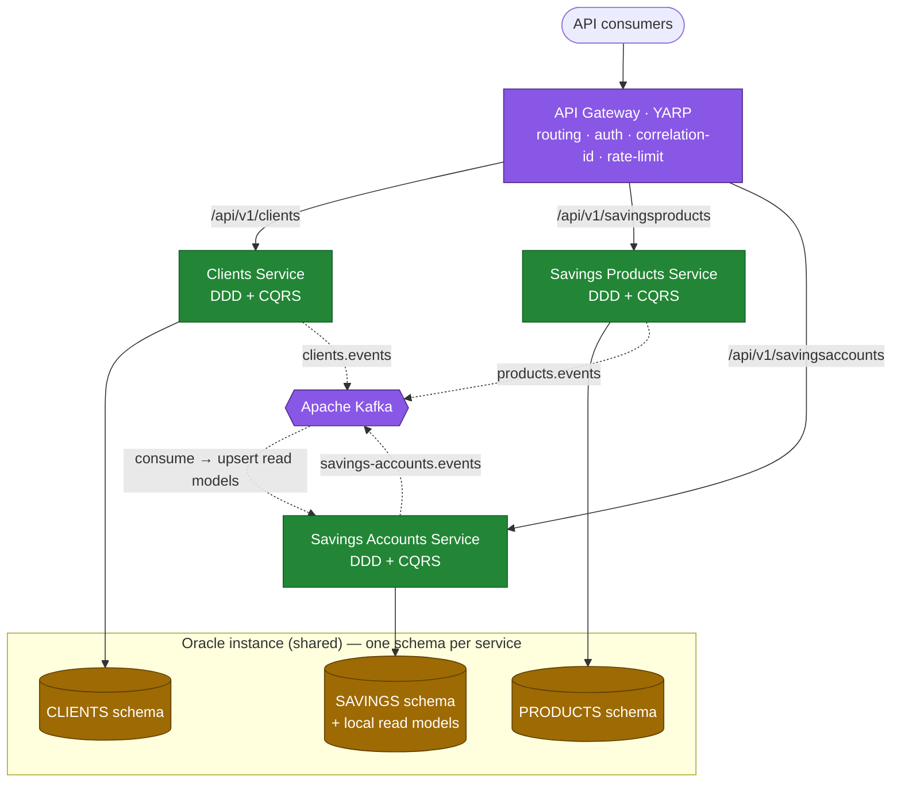

### Service catalogue

| Service | Owns (schema) | Publishes (topic) | Consumes |
|---|---|---|---|
| **Clients** | `CLIENTS` — clients | `clients.events`: `ClientRegistered`, `ClientActivated` | — |
| **Savings Products** | `PRODUCTS` — products | `products.events`: `SavingsProductCreated`, `SavingsProductUpdated` | — |
| **Savings Accounts** | `SAVINGS` — accounts + `CLIENT_REF` / `PRODUCT_REF` read models | `savings-accounts.events`: `SavingsAccountSubmitted/Approved/Activated/Rejected/Withdrawn` | `clients.events`, `products.events` |

---

## 5. Per-service internal architecture (DDD + Clean Architecture)

**Every** microservice has the same internal shape; dependencies point inward only. Shared **technical** building blocks are factored into a small set of `BuildingBlocks` libraries (no business logic — services stay autonomous).

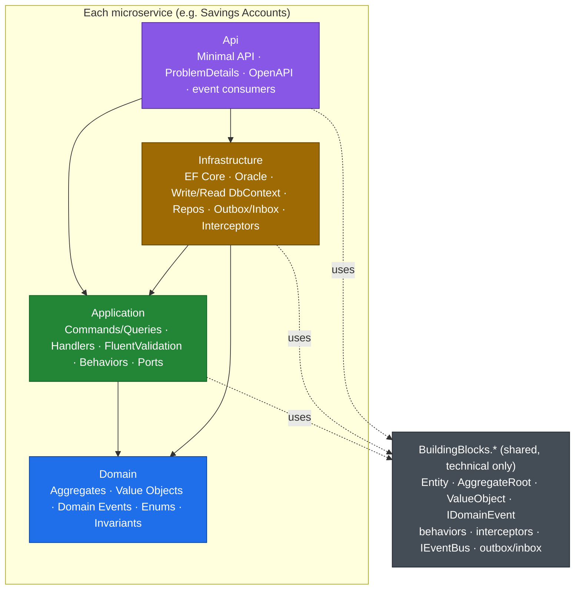

**Dependency rule (enforced by architecture tests, per service):** `Domain` → nothing. `Application` → `Domain`. `Infrastructure` → `Application` + `Domain`. `Api` → all. `BuildingBlocks` carry **technical** concerns only.

---

## 6. Repository & solution structure (monorepo)

```text
CoreBanking/
├─ CoreBanking.sln                       # optional roll-up; each service also has its own .sln
├─ Directory.Build.props                 # net10.0, nullable, analyzers, langversion
├─ Directory.Packages.props              # central package versions
├─ global.json                           # pin .NET 10 SDK
├─ .editorconfig
├─ shared/
│  ├─ CoreBanking.BuildingBlocks.Domain/        # Entity, AggregateRoot, ValueObject, IDomainEvent, AuditableEntity
│  ├─ CoreBanking.BuildingBlocks.Application/   # ICurrentUser, IDateTimeProvider, pipeline behaviors, exceptions
│  ├─ CoreBanking.BuildingBlocks.Infrastructure/# audit & domain-event interceptors, Write/Read context base, ProblemDetails
│  └─ CoreBanking.BuildingBlocks.Messaging/     # IEventBus, IntegrationEvent base, Kafka, Outbox dispatcher, Inbox/idempotency
├─ services/
│  ├─ clients/
│  │  ├─ CoreBanking.Clients.Domain/            # Client aggregate, ClientStatus, events
│  │  ├─ CoreBanking.Clients.Application/       # RegisterClient, ActivateClient, queries, validators
│  │  ├─ CoreBanking.Clients.Infrastructure/    # EF Oracle (CLIENTS schema), repos, outbox, migrations
│  │  ├─ CoreBanking.Clients.Api/               # endpoints + DI
│  │  └─ tests/ (Domain.UnitTests, Application.UnitTests, Architecture.Tests, IntegrationTests)
│  ├─ savings-products/
│  │  ├─ CoreBanking.SavingsProducts.Domain/    # SavingsProduct aggregate
│  │  ├─ ...Application / ...Infrastructure (PRODUCTS schema) / ...Api
│  │  └─ tests/ …
│  └─ savings-accounts/
│     ├─ CoreBanking.SavingsAccounts.Domain/    # SavingsAccount aggregate (root), VOs, lifecycle, events
│     ├─ CoreBanking.SavingsAccounts.Application/# Submit/Approve/Activate/Reject/Withdraw, queries
│     ├─ CoreBanking.SavingsAccounts.Infrastructure/ # SAVINGS schema, repos, ClientRef/ProductRef projections,
│     │                                          #   event consumers, outbox+inbox, migrations
│     ├─ CoreBanking.SavingsAccounts.Api/
│     └─ tests/ …
├─ gateway/
│  └─ CoreBanking.Gateway/                       # YARP reverse proxy
├─ tests/
│  └─ CoreBanking.ContractTests/                 # cross-service integration-event contract tests
└─ docker/
   ├─ docker-compose.yml                         # profiles: free, dataguard
   ├─ .env.example
   ├─ oracle/ (init scripts: create schema/user per service)
   ├─ dataguard/ (primary + standby + broker)
   └─ kafka/ (topic bootstrap: create compacted reference topics)
```

---

## 7. Domain model

DDD tactical patterns, **per service**. The `SavingsAccount` aggregate is the centrepiece; `Client` and `SavingsProduct` are **full aggregates in their own services**, and appear inside the Savings Accounts service only as **local read-model replicas** (`ClientRef`, `ProductRef`) populated from integration events — never as foreign aggregates or cross-schema FKs.

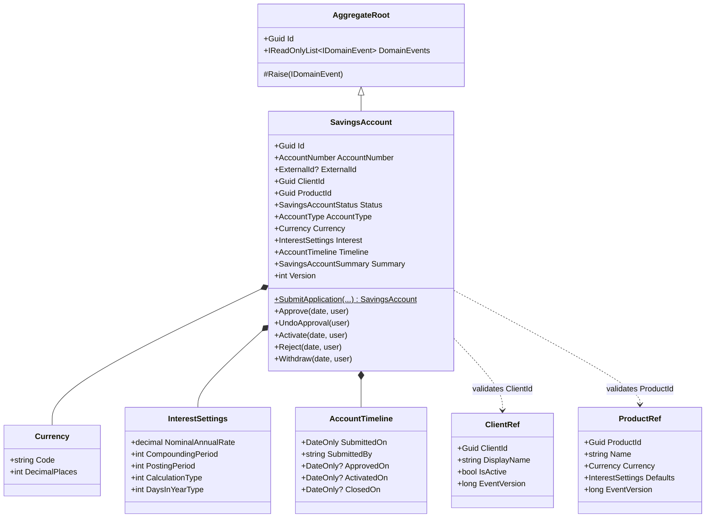

> The **Clients** service owns a `Client` aggregate (name, `ExternalId`, `ClientStatus`, activation date; factory `Register(...)`, `Activate(...)`). The **Savings Products** service owns a `SavingsProduct` aggregate (name, short name, currency, default interest settings; factory `Create(...)`). Both extend the shared `AggregateRoot`/`AuditableEntity` building blocks.

### Lifecycle state machine (Savings Accounts service)

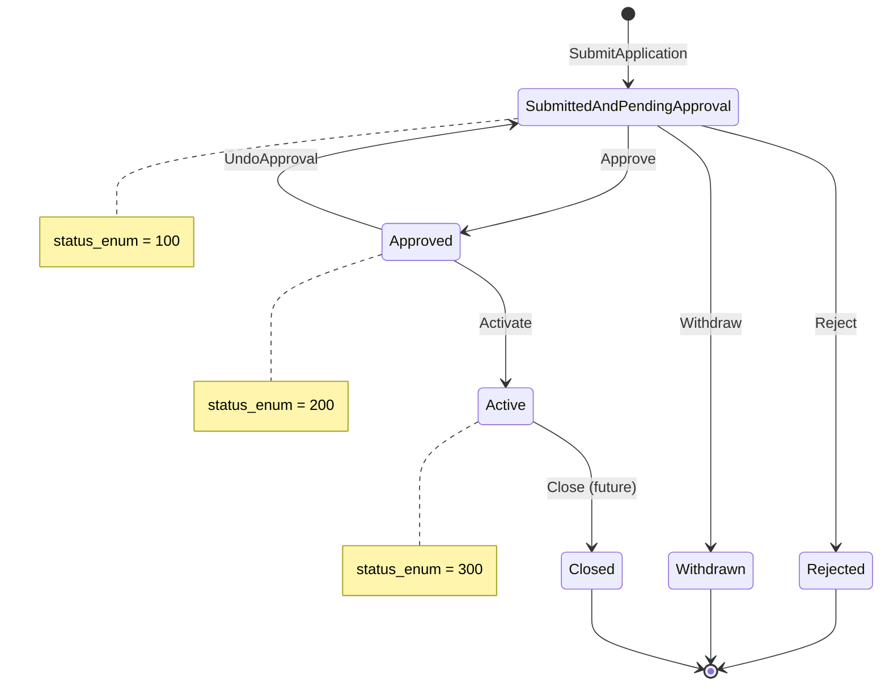

Each transition guards the source state and raises a **domain event**; illegal transitions throw a domain exception → HTTP 422. Status codes stay faithful to Fineract (100/200/300/400/500/600).

---

## 8. Application layer (CQRS, per service)

- **Mediator:** `martinothamar/Mediator` (MIT, source-generated). MediatR moved to a commercial license on 2025-07-02, so we use a permissive alternative.
- **Commands → `WriteDbContext` (primary):** e.g. Clients: `RegisterClient`, `ActivateClient`; Products: `CreateSavingsProduct`; Accounts: `SubmitSavingsApplication`, `ApproveSavingsAccount`, `ActivateSavingsAccount`, `RejectSavingsAccount`, `WithdrawSavingsApplication`.
- **Queries → `ReadDbContext` (replica, NoTracking):** `Get…ById`, `List…`.
- **Validation:** **FluentValidation** in a pipeline behavior (the modern `DataValidatorBuilder`) — accumulates all errors → `ValidationException` → 400.
- **Pipeline behaviors (ordered):** Logging → Validation → UnitOfWork (one EF transaction per command, persists the **outbox** record atomically) — the analog of Fineract's `@Transactional`.
- **Event consumers** (Accounts service): Kafka consumers for `clients.events`/`products.events` that idempotently upsert `ClientRef`/`ProductRef` via the **inbox** pattern.

---

## 9. Inter-service communication (hybrid)

**Reference data is replicated asynchronously; account-open validates against the local read model. Synchronous calls are a fallback only.**

### (a) Event-driven reference replication + local validation

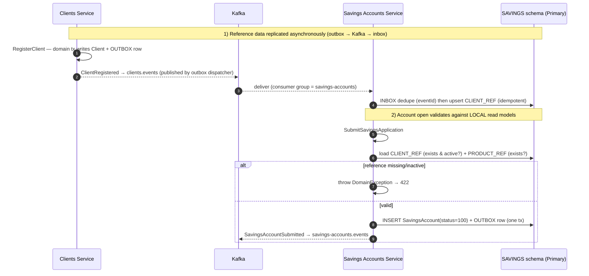

### (b) Synchronous fallback (only when needed)

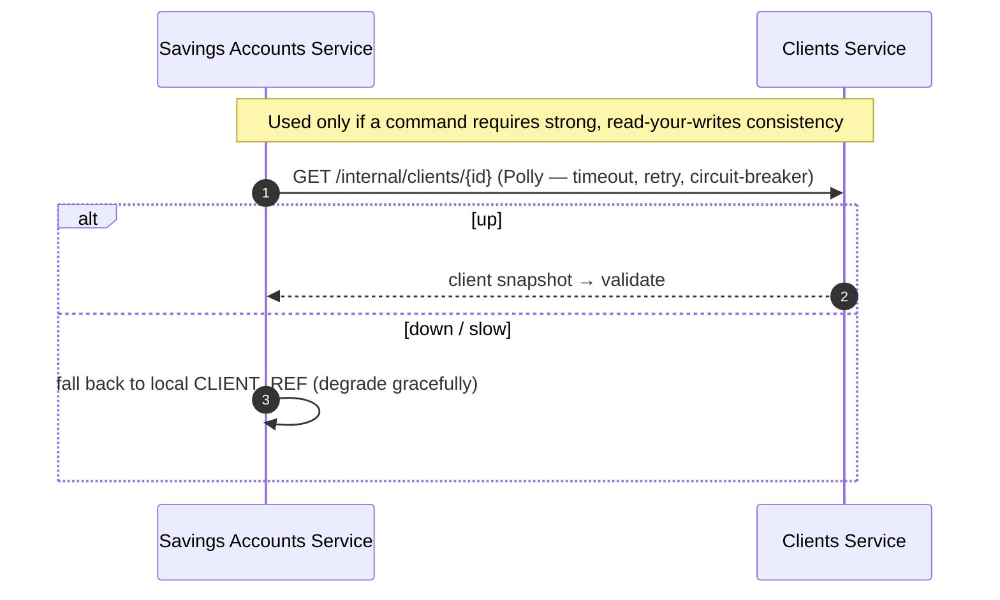

### Kafka topic design
- **Topics (one per source aggregate):** `clients.events`, `products.events`, `savings-accounts.events`. Each message carries a typed envelope (`eventId`, `type`, `occurredOnUtc`, `version`, payload).
- **Keying & ordering:** messages are keyed by aggregate id (`ClientId` / `ProductId` / `SavingsAccountId`) so all events for one entity land on the same partition and stay **ordered**.
- **Log compaction for reference topics:** `clients.events` and `products.events` are **compacted** (keyed by entity id) so Kafka retains the latest state per client/product **indefinitely**.
- **Consumer groups:** each consuming service uses its own group (e.g. `savings-accounts`) and tracks its own offsets independently.

### Replay → rebuild read models (the reason for Kafka)

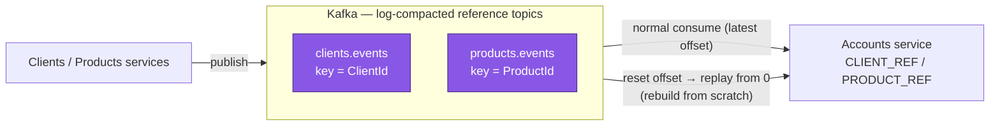

A wiped or brand-new read model (or an entirely new consuming service) re-materialises itself by **replaying the compacted log** — no snapshot/re-publish mechanism needed.

### Messaging mechanics
- **Broker:** **Apache Kafka** (Apache-2.0), **KRaft mode** (no ZooKeeper). Single broker in dev; partitioned/replicated topics in prod.
- **Transactional outbox (per service):** integration events are written to an `OUTBOX_MESSAGES` row **in the same DB transaction** as the domain change; a background dispatcher publishes them to Kafka and marks them processed → no lost/ghost events.
- **Inbox / idempotency (per consumer):** an `INBOX_MESSAGES` table dedupes by `eventId` (and `(topic, partition, offset)`) so redelivery is safe.
- **Versioning:** each `*Ref` row carries an `EventVersion`; older/out-of-order events are ignored.
- **No distributed transaction:** the account lifecycle is entirely local to the Accounts service; cross-service is *only* reference-data replication. No saga required for this scope.
- **Library note:** we use **`Confluent.Kafka`** (Apache-2.0) behind a thin `IEventBus`; MassTransit and Wolverine offer Kafka support but are now commercially licensed, so we keep hand-rolled consumers + the inbox. **Polly** handles resilience on the sync fallback. Schema management is optional via **Apicurio Registry** (OSS) or versioned JSON contracts (enforced by contract tests).

---

## 10. Persistence & read/write split (per service)

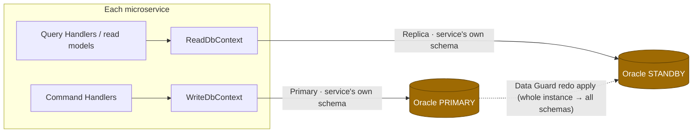

- **Each service** has its own `WriteDbContext` (primary, change-tracking, owns that schema's migrations) and `ReadDbContext` (standby, `NoTracking`, read-only) — base classes from `BuildingBlocks.Infrastructure`.
- **Schema-per-service on a shared instance:** every service connects as its **own Oracle user/schema** (`CLIENTS`, `PRODUCTS`, `SAVINGS`). One instance in `free`; one primary+standby pair in `dataguard` (Data Guard replicates the whole instance, so all schemas are available read-only on the standby).
- **Connection strings per service:** `ConnectionStrings:Primary` / `ConnectionStrings:Replica` (same instance in `free`).
- **Optimistic concurrency:** `Version` column as EF concurrency token → 409 (Fineract's `@Version`).
- **Trade-off (chosen):** logical data ownership with a shared failure domain; can graduate to dedicated instances per service later with no app-code change.

---

## 11. Database schema (per service)

No cross-service foreign keys. Within the Savings Accounts schema, the account table *may* FK to its **local** `CLIENT_REF`/`PRODUCT_REF` read models (same schema).

### Clients service — `CLIENTS` schema

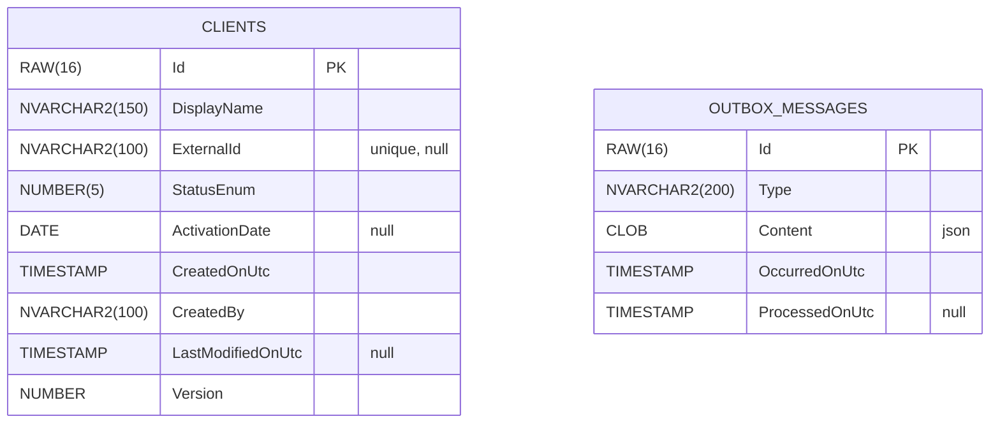

### Savings Products service — `PRODUCTS` schema

```mermaid
erDiagram
    SAVINGS_PRODUCTS {
        RAW(16) Id PK
        NVARCHAR2(150) Name
        NVARCHAR2(50) ShortName "unique"
        VARCHAR2(3) CurrencyCode
        NUMBER(5) CurrencyDigits
        NUMBER(19,6) NominalAnnualInterestRate
        NUMBER(5) InterestCompoundingPeriodEnum
        NUMBER(5) InterestPostingPeriodEnum
        NUMBER(5) InterestCalculationTypeEnum
        NUMBER(5) InterestCalcDaysInYearEnum
        NUMBER Version
    }
    OUTBOX_MESSAGES {
        RAW(16) Id PK
        NVARCHAR2(200) Type
        CLOB Content "json"
        TIMESTAMP OccurredOnUtc
        TIMESTAMP ProcessedOnUtc "null"
    }
```

### Savings Accounts service — `SAVINGS` schema

```mermaid
erDiagram
    CLIENT_REF ||--o{ SAVINGS_ACCOUNTS : "validated by (local)"
    PRODUCT_REF ||--o{ SAVINGS_ACCOUNTS : "templated by (local)"

    CLIENT_REF {
        RAW(16) ClientId PK
        NVARCHAR2(150) DisplayName
        NUMBER(1) IsActive
        NUMBER EventVersion
    }
    PRODUCT_REF {
        RAW(16) ProductId PK
        NVARCHAR2(150) Name
        VARCHAR2(3) CurrencyCode
        NUMBER(5) CurrencyDigits
        NUMBER(19,6) DefaultInterestRate
        NUMBER EventVersion
    }
    SAVINGS_ACCOUNTS {
        RAW(16) Id PK
        VARCHAR2(20) AccountNo "unique"
        NVARCHAR2(100) ExternalId "unique, null"
        RAW(16) ClientId FK
        RAW(16) ProductId FK
        NUMBER(5) StatusEnum "100/200/300/400/500/600"
        NUMBER(5) AccountTypeEnum
        VARCHAR2(3) CurrencyCode
        NUMBER(5) CurrencyDigits
        NUMBER(19,6) NominalAnnualInterestRate
        NUMBER(5) InterestCompoundingPeriodEnum
        NUMBER(5) InterestPostingPeriodEnum
        NUMBER(5) InterestCalculationTypeEnum
        NUMBER(5) InterestCalcDaysInYearEnum
        NUMBER(1) AllowOverdraft
        NUMBER(19,6) OverdraftLimit "null"
        NUMBER(1) EnforceMinRequiredBalance
        NUMBER(19,6) MinRequiredBalance "null"
        NUMBER(19,6) AccountBalanceDerived
        DATE SubmittedOnDate
        NVARCHAR2(100) SubmittedByUser
        DATE ApprovedOnDate "null"
        DATE ActivatedOnDate "null"
        DATE ClosedOnDate "null"
        TIMESTAMP CreatedOnUtc
        NVARCHAR2(100) CreatedBy
        TIMESTAMP LastModifiedOnUtc "null"
        NUMBER Version
    }
    OUTBOX_MESSAGES {
        RAW(16) Id PK
        NVARCHAR2(200) Type
        CLOB Content "json"
        TIMESTAMP OccurredOnUtc
        TIMESTAMP ProcessedOnUtc "null"
    }
    INBOX_MESSAGES {
        RAW(16) EventId PK
        NVARCHAR2(200) Type
        TIMESTAMP ReceivedOnUtc
        TIMESTAMP ProcessedOnUtc "null"
    }
```

> **Oracle type notes:** money/rates `NUMBER(19,6)` (= Fineract `DECIMAL(19,6)`); enums `NUMBER(5)`; booleans `NUMBER(1)`; GUID keys `RAW(16)` (sequential GUIDs to limit index fragmentation); unicode text `NVARCHAR2`. Indexes: unique on `AccountNo`/`ExternalId`; index on `StatusEnum`, `ClientId`; `OUTBOX_MESSAGES(ProcessedOnUtc)` for the dispatcher poll.

---

## 12. Cross-cutting concerns (shared building blocks)

| Concern | Implementation | Fineract analog |
|---|---|---|
| **Auditing** | `AuditableEntityInterceptor` stamps Created/LastModified from `ICurrentUser` + `IDateTimeProvider` | `AbstractAuditableCustom` |
| **Domain → integration events** | aggregates raise domain events → interceptor writes to `OUTBOX_MESSAGES` → dispatcher publishes to Kafka | `BusinessEventNotifierService` |
| **Idempotent consumption** | `INBOX_MESSAGES` dedupe by `eventId` | (n/a) |
| **Concurrency** | `Version` EF concurrency token → 409 | `@Version` |
| **Errors** | RFC 7807 ProblemDetails: validation→400, domain→422, not-found→404, concurrency→409 | `PlatformApiDataValidationException` |
| **Resilience** | Polly (timeout/retry/circuit-breaker) on sync fallback + consumers | (n/a) |
| **Multi-tenancy** | `ICurrentTenant` seam; single-tenant runtime | per-tenant routing |
| **Correlation** | correlation-id propagated gateway → services → event headers | — |
| **Maker-checker (foundation)** | optional per-service `COMMAND_AUDIT` table | `m_portfolio_command_source` |

---

## 13. API gateway & surface

**Gateway:** **YARP** (open source) — single entry point, path-based routing to services, auth, rate-limit, correlation-id injection, OpenAPI aggregation.

| Verb & route (public, via gateway) | Service | Action |
|---|---|---|
| `POST /api/v1/clients` | Clients | Register client |
| `POST /api/v1/clients/{id}/activate` | Clients | Activate client |
| `POST /api/v1/savingsproducts` | Products | Create product |
| `POST /api/v1/savingsaccounts` | Accounts | **Submit** application (201) |
| `POST /api/v1/savingsaccounts/{id}/approve` | Accounts | Approve |
| `POST /api/v1/savingsaccounts/{id}/activate` | Accounts | Activate |
| `POST /api/v1/savingsaccounts/{id}/reject` | Accounts | Reject |
| `POST /api/v1/savingsaccounts/{id}/withdraw` | Accounts | Withdraw |
| `GET  /api/v1/savingsaccounts/{id}` | Accounts | Fetch one (read context) |
| `GET  /api/v1/savingsaccounts` | Accounts | List (read context) |

Each service exposes Minimal API endpoints; internal-only endpoints (e.g. `GET /internal/clients/{id}` for the sync fallback) are not routed publicly by the gateway.

---

## 14. Docker & Oracle topology (one compose, two profiles)

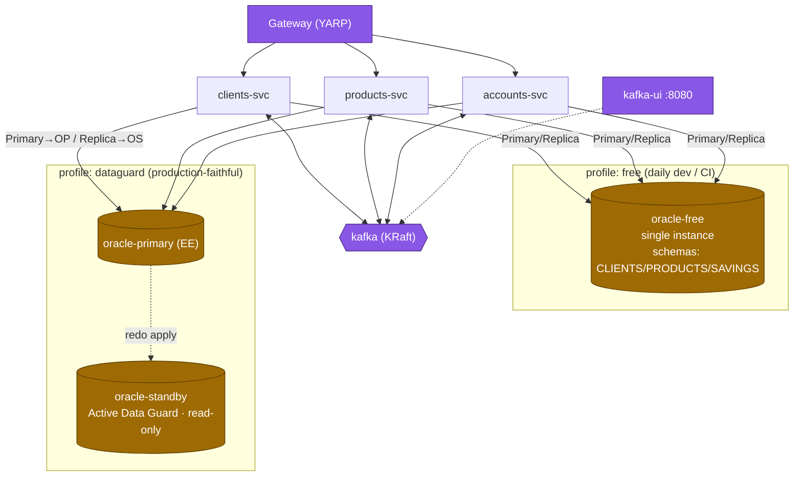

- **`free` profile** — `gateway`, 3 services, `kafka` (KRaft, single broker), `kafka-ui`, and **one** `oracle-free` (23ai Free) holding all three schemas. `Primary == Replica`. Fast; used for dev + CI/integration tests.
- **`dataguard` profile** — swaps the single Oracle for `oracle-primary` (EE) + `oracle-standby` (Active Data Guard, read-only); each service's `Replica` → standby. Kafka + Kafka UI stay the same. Patterned on `oraclesean/dataguard-cn`.
- **Kafka** runs as a single-node **KRaft** broker (`apache/kafka` image, no ZooKeeper); a small init step creates the topics and marks the reference topics **compacted**.
- **Kafka UI** (`kafbat/kafka-ui` — the maintained successor to `provectus/kafka-ui`) runs at **http://localhost:8080** to browse topics, inspect messages/keys, and watch consumer-group lag.
- Init scripts create one Oracle user/schema per service; health checks + wait-for-dependencies gate service startup; each service runs **its own** migrations against the primary on boot (in `free`).

### Analysis & caveats (important)
- A **true Oracle read/write cluster requires Active Data Guard = Enterprise Edition**. Oracle 23ai **Free supports neither Data Guard nor standby**, so the physical read cluster exists **only** on the `dataguard` profile; on `free` the split is logical (real in-app, one instance underneath).
- **EE licensing:** EE container images are dev/test-licensed via Oracle's registry; production EE + Active Data Guard require commercial licensing — confirm before any prod deploy.
- **Eventual consistency:** local read models and standby reads lag (sub-second typically). Account-open against `CLIENT_REF` can briefly 422 if a just-created client's event hasn't been consumed yet — the **sync fallback** covers cases needing read-your-writes.
- **Shared instance, shared failure domain:** schema-per-service gives logical ownership, not physical isolation; graduating to dedicated instances later is a config change.

---

## 15. Testing & quality gates

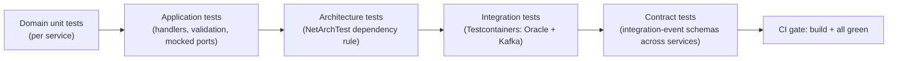

- **Per-service:** domain unit (lifecycle/invariants), application (handlers + validation), architecture (dependency rule).
- **Integration:** Testcontainers spins **Oracle Free + Kafka**; tests migrations, command→DB→query, outbox publish, inbox dedupe, concurrency→409, read-model upsert from a consumed event, and **read-model rebuild by replay**.
- **Contract tests:** assert each published integration event matches the schema consumers expect (prevents cross-service breakage).
- **CI:** `dotnet build` + `dotnet test` across all services; fail on warnings; coverage.

---

## 16. Technology stack & packages

| Area | Package / tech | Notes |
|---|---|---|
| Runtime | **.NET 10**, C# 14 | LTS |
| Gateway | `Yarp.ReverseProxy` | open source (Microsoft) |
| Mediator | `Mediator.SourceGenerator`, `Mediator.Abstractions` | `martinothamar/Mediator`, MIT |
| Validation | `FluentValidation(.DependencyInjectionExtensions)` | replaces `DataValidatorBuilder` |
| ORM | `Microsoft.EntityFrameworkCore` 10.x | |
| Oracle provider | `Oracle.EntityFrameworkCore` 10.23.x | EF Core 10 certified, Oracle 19c+ |
| EF tooling | `Microsoft.EntityFrameworkCore.Design`, `dotnet-ef` | per-service migrations |
| Broker | **Apache Kafka** (KRaft, `apache/kafka` image) | Apache-2.0; no ZooKeeper |
| Kafka client | `Confluent.Kafka` behind `IEventBus` | Apache-2.0; avoid commercial MassTransit/Wolverine |
| Kafka console | `kafbat/kafka-ui` | browse topics / messages / consumer lag |
| Schema (optional) | Apicurio Registry (OSS) or JSON contracts | enforced by contract tests |
| Resilience | `Polly` / `Microsoft.Extensions.Http.Resilience` | sync fallback + consumers |
| API docs | `Microsoft.AspNetCore.OpenApi` | per service; aggregated at gateway |
| Logging | `Serilog.AspNetCore` | structured + correlation id |
| Arch tests | `NetArchTest.Rules` | per service |
| Unit tests | `xUnit`, `FluentAssertions`, `NSubstitute` | |
| Integration | `Testcontainers`, `Testcontainers.Oracle`, `Testcontainers.Kafka` | |

> Exact patch versions pinned in `Directory.Packages.props` at implementation time.

---

## 17. Fineract → CoreBanking mapping

| Fineract (modular monolith) | CoreBanking (microservices, .NET 10) |
|---|---|
| Modules (portfolio/client, portfolio/savings) | Separate **services** (Clients, Products, Accounts) |
| `SavingsAccountsApiResource` | Accounts service Minimal API + YARP route |
| `CommandWrapper` + `@CommandType` handler | Mediator command + `IRequestHandler` (per service) |
| `SavingsAccountDataValidator` / `DataValidatorBuilder` | FluentValidation + `ValidationBehavior` |
| `SavingsAccountAssembler` | Command handler mapping |
| `...WritePlatformService` + `@Transactional` | Handler + `UnitOfWorkBehavior` |
| `createNewApplicationForSubmittal(...)` | `SavingsAccount.SubmitApplication(...)` factory |
| `SavingsAccountStatusType` | `SavingsAccountStatus` enum (same codes) |
| `AbstractAuditableCustom` | `AuditableEntity` + interceptor (BuildingBlocks) |
| `@Version` | EF concurrency token |
| `BusinessEventNotifierService` (in-process) | **Integration events** over Apache Kafka + outbox/inbox |
| In-process module calls | Async events + local read models (+ sync fallback) |
| Spring Data JPA repo | EF Core repos + Write/Read contexts (per service) |
| Liquibase changelog | EF Core migrations (per service, Oracle DDL) |
| Single DB (MySQL/Maria/PG) | Oracle, **schema-per-service** (Free / Active Data Guard) |

---

## 18. Implementation plan (phased)

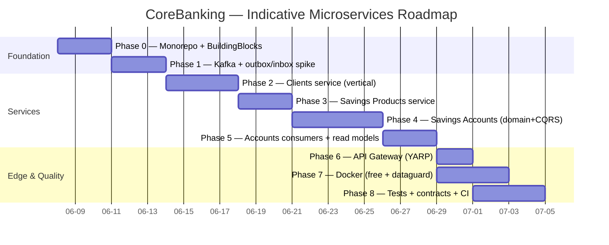

- **Phase 0 — Monorepo + BuildingBlocks.** Solution(s), `Directory.*.props`, `global.json`; the four `BuildingBlocks.*` libraries (Entity/AggregateRoot/VO, behaviors, interceptors, messaging abstractions). *Done when:* everything builds; a sample aggregate + outbox interceptor unit-tests green.
- **Phase 1 — Kafka + outbox/inbox spike.** `IEventBus` over `Confluent.Kafka`, outbox dispatcher, inbox dedupe, compacted-topic bootstrap, Testcontainers Kafka test. *Done when:* an event published from a test publisher is consumed exactly once, and a replay rebuilds a read model.
- **Phase 2 — Clients service.** Full vertical slice (Domain→Api), `CLIENTS` schema + migration, publishes to `clients.events`. *Done when:* register/activate works against Oracle Free; events visible in Kafka UI.
- **Phase 3 — Savings Products service.** Same pattern, `PRODUCTS` schema, publishes to `products.events`. *Done when:* create/list works; events published.
- **Phase 4 — Savings Accounts (core).** `SavingsAccount` aggregate + full lifecycle + CQRS + `SAVINGS` schema + migration. *Done when:* lifecycle unit/integration tests green (incl. concurrency 409).
- **Phase 5 — Accounts consumers + read models.** Kafka consumers for Client/Product events → upsert `CLIENT_REF`/`PRODUCT_REF` (inbox); submit validates against them; publish account events. *Done when:* end-to-end create-client→open-account works via events.
- **Phase 6 — API Gateway.** YARP routes, correlation-id, OpenAPI aggregation. *Done when:* all endpoints reachable through the gateway.
- **Phase 7 — Docker topology.** `docker-compose.yml` with `free` + `dataguard` profiles, Kafka + Kafka UI, init scripts, health checks, README. *Done when:* `--profile free up` runs the whole platform; `--profile dataguard up` brings up primary+standby serving reads.
- **Phase 8 — Tests + contracts + CI.** Architecture tests per service, contract tests for events, CI workflow. *Done when:* all suites green in CI.

---

## 19. Open decisions & assumptions

Decided to keep momentum — flag any to change:

1. **Comms:** hybrid — async events + local read models, **sync fallback only** where strong consistency is required. *(your choice)*
2. **Data ownership:** **schema-per-service on one shared Oracle instance** (logical isolation; graduate to dedicated instances later). *(your choice)*
3. **Broker:** **Apache Kafka (KRaft)** with **Kafka UI** for observability; compacted reference topics enable read-model rebuild by replay. *(your choice)*
4. **Services:** exactly three (Clients, Products, Accounts) for this slice + a YARP gateway.
5. **Shared code:** `BuildingBlocks.*` carry **technical** concerns only; no shared domain — services stay autonomous.
6. **Messaging library:** `Confluent.Kafka` (Apache-2.0) behind a thin `IEventBus`; **not** commercial MassTransit/Wolverine. Outbox + inbox for reliability/idempotency.
7. **No saga:** the account lifecycle is local to the Accounts service; cross-service is reference-data replication only.
8. **Mediator:** `martinothamar/Mediator` (MIT), per service.
9. **Naming/keys:** modern table names; `RAW(16)` sequential-GUID keys; exceptions→ProblemDetails (not `Result<T>`).
10. **Multi-tenancy:** single-tenant runtime, tenant-ready seams.

---

## 20. References

- Apache Fineract savings module: `fineract-provider/src/main/java/org/apache/fineract/portfolio/savings/`.
- Oracle Entity Framework Core 10 — https://www.nuget.org/packages/oracle.entityframeworkcore
- MediatR & MassTransit going commercial — https://www.milanjovanovic.tech/blog/mediatr-and-masstransit-going-commercial-what-this-means-for-you
- `martinothamar/Mediator` — https://github.com/martinothamar/Mediator
- YARP reverse proxy — https://github.com/dotnet/yarp
- Apache Kafka (KRaft) — https://kafka.apache.org/documentation/#kraft
- `Confluent.Kafka` .NET client — https://github.com/confluentinc/confluent-kafka-dotnet
- Kafka UI (Kafbat) — https://github.com/kafbat/kafka-ui
- Oracle Data Guard on Docker — https://github.com/oraclesean/dataguard-cn
- Oracle 23ai Free vs Enterprise (Data Guard availability) — https://www.ncs-london.com/blog/oracle-23ai-free-vs-enterprise-which-version-is-right-for-your-business/
