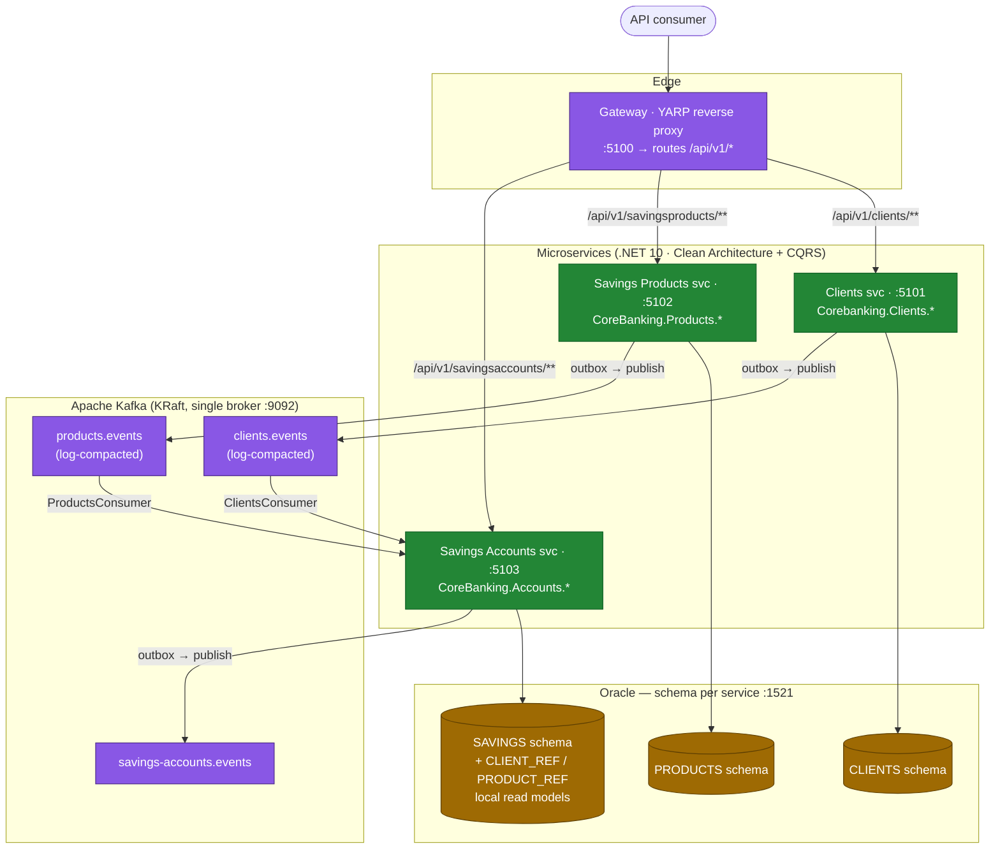
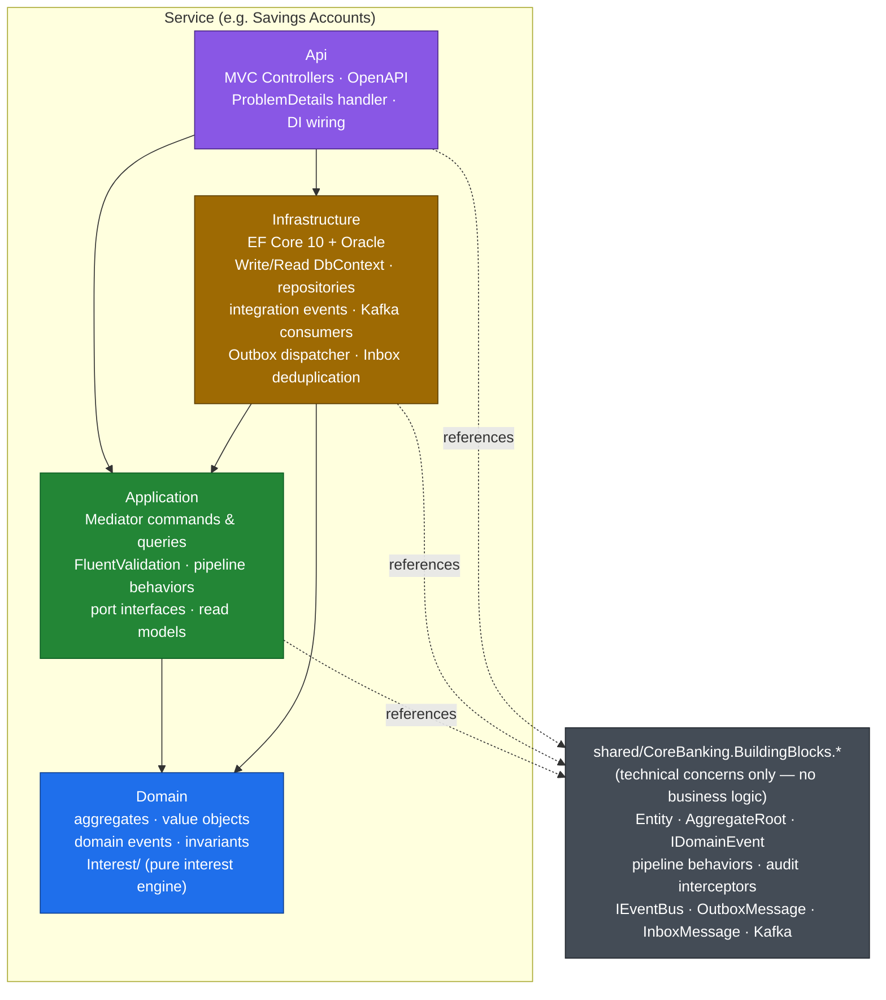
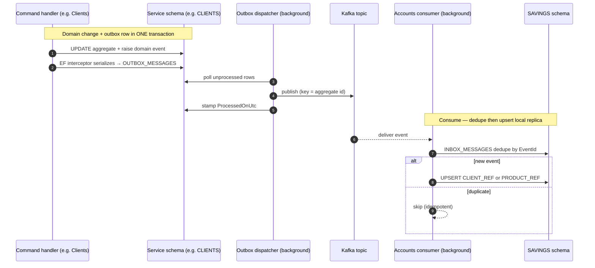
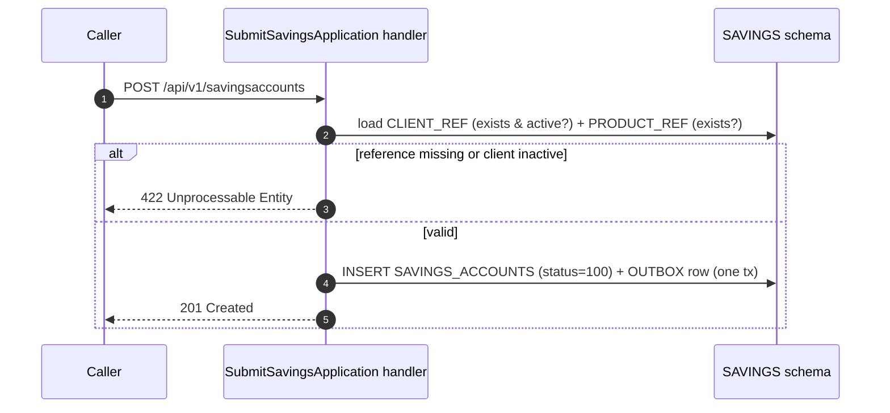
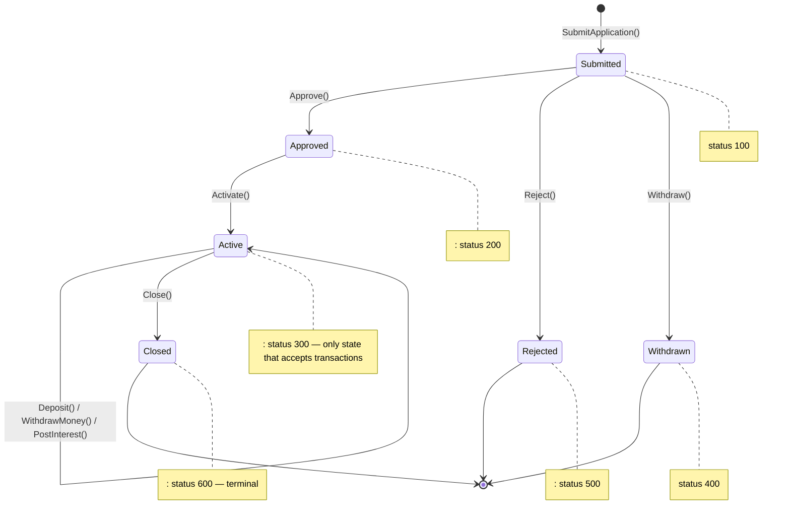
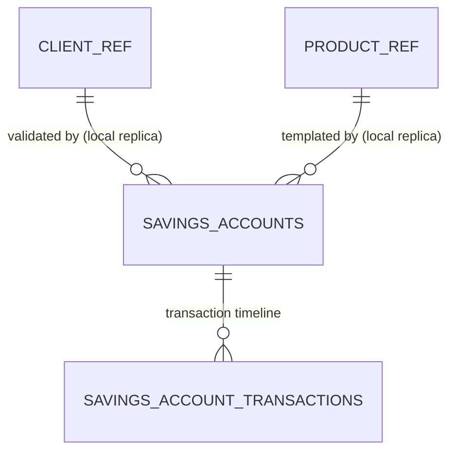
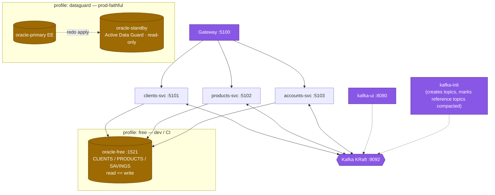

# CoreBanking

A production-grade **.NET 10 microservices platform** for core savings-account banking. Three autonomous services — **Clients**, **Savings Products**, **Savings Accounts** — sit behind a YARP API gateway and communicate asynchronously over **Apache Kafka**. Each service is built with Clean Architecture + DDD + CQRS, owns its own Oracle schema, and runs its own EF Core migrations.

---

## Table of Contents

- [Global Architecture](#global-architecture)
- [Services](#services)
- [Internal Service Architecture](#internal-service-architecture)
- [Event-Driven Integration](#event-driven-integration)
- [Savings Account Lifecycle](#savings-account-lifecycle)
- [Persistence](#persistence)
- [Deployment](#deployment)
- [Getting Started](#getting-started)
- [Testing](#testing)

---

## Global Architecture



> **No synchronous service-to-service calls. No cross-schema queries.** Services share state only by publishing integration events. The Accounts service keeps local replicas (`CLIENT_REF`, `PRODUCT_REF`) populated by consuming the compacted reference topics.

---

## Services

| Service | Namespace | Port | Oracle Schema | Publishes | Consumes |
|---|---|---|---|---|---|
| **Clients** | `CoreBanking.Clients.*` | `:5101` | `CLIENTS` | `ClientRegistered`, `ClientActivated` → `clients.events` | — |
| **Savings Products** | `CoreBanking.Products.*` | `:5102` | `PRODUCTS` | `SavingsProductCreated` → `products.events` | — |
| **Savings Accounts** | `CoreBanking.Accounts.*` | `:5103` | `SAVINGS` | `SavingsAccountSubmitted/Approved/Activated/Rejected/Withdrawn/Closed`, `SavingsDeposited`, `SavingsWithdrawn`, `SavingsInterestPosted` → `savings-accounts.events` | `clients.events`, `products.events` |
| **Gateway** | `CoreBanking.Gateway` | `:5100` | — | — | — |

### API Endpoints

| Method & Route | Service | Action |
|---|---|---|
| `POST /api/v1/clients` | Clients | Register a client |
| `POST /api/v1/clients/{id}/activate` | Clients | Activate client |
| `GET  /api/v1/clients/{id}` | Clients | Get by id |
| `POST /api/v1/savingsproducts` | Products | Create product |
| `GET  /api/v1/savingsproducts/{id}` | Products | Get by id |
| `GET  /api/v1/savingsproducts` | Products | List all products |
| `POST /api/v1/savingsaccounts` | Accounts | Submit account application |
| `POST /api/v1/savingsaccounts/{id}/approve` | Accounts | Approve application |
| `POST /api/v1/savingsaccounts/{id}/activate` | Accounts | Activate account |
| `POST /api/v1/savingsaccounts/{id}/reject` | Accounts | Reject application |
| `POST /api/v1/savingsaccounts/{id}/withdraw` | Accounts | Withdraw application |
| `POST /api/v1/savingsaccounts/{id}/close` | Accounts | Close account |
| `POST /api/v1/savingsaccounts/{id}/transactions/deposit` | Accounts | Deposit money |
| `POST /api/v1/savingsaccounts/{id}/transactions/withdraw` | Accounts | Withdraw money |
| `POST /api/v1/savingsaccounts/{id}/postinterest` | Accounts | Post accrued interest (idempotent) |
| `GET  /api/v1/savingsaccounts/{id}/transactions` | Accounts | List transactions |
| `GET  /api/v1/savingsaccounts/{id}` | Accounts | Get account by id |

---

## Internal Service Architecture

Every service shares the same four-project Clean Architecture shape. Dependencies point **inward only** — enforced at build time by `*.ArchTests` (NetArchTest).



**Dependency rule:** Domain → nothing · Application → Domain · Infrastructure → Application + Domain · Api → all.

**Request pipeline:** `LoggingBehavior` → `ValidationBehavior` (FluentValidation; failures → HTTP 400). Commands use the **Write** DbContext (primary, change-tracked); queries use the **Read** DbContext (replica, `NoTracking`). Errors map to RFC 7807 ProblemDetails: `validation→400`, `domain→422`, `not-found→404`, `concurrency→409`.

**Mediator:** [`martinothamar/Mediator`](https://github.com/martinothamar/Mediator) (source-generated) — **not MediatR**. Handlers implement `ICommandHandler<,>` / `IQueryHandler<,>` and return `ValueTask`.

---

## Event-Driven Integration

### Transactional outbox → Kafka → idempotent inbox



### Account opening — local replica validation



**Key facts:**
- Adding a new published event is a **3-part change**: raise domain event (Domain) → declare integration event (Infrastructure `Events/`) → add `case` to `DomainEventToIntegrationEventMap` in `Infrastructure/DependencyInjection.cs`.
- `clients.events` and `products.events` are **log-compacted** and keyed by entity id — replay from offset 0 to rebuild a wiped read model with no republish needed.
- `savings-accounts.events` is a normal (non-compacted) event stream.

---

## Savings Account Lifecycle



- **Deposit** (type 1), **Withdraw** (type 2), **PostInterest** (type 3) only while `Active`.
- Withdrawals are validated against the full transaction timeline — balance may never go negative at any point, including backdated entries.
- Interest uses the **daily-balance method** with configurable compounding (daily/monthly), posting periods (monthly/quarterly/biannual/annual), and 360/365 day-count. All `decimal` arithmetic — no `Math.Pow`.
- Interest posting is **forward-only**: transactions on/before `InterestPostedTillDate` are rejected. Re-posting for the same date is idempotent.
- Closing requires zero balance; an optional `withdrawBalance=true` flag settles the balance first before marking the account closed.

---

## Persistence



| Schema | Tables |
|---|---|
| `CLIENTS` | `CLIENTS`, `OUTBOX_MESSAGES` |
| `PRODUCTS` | `SAVINGS_PRODUCTS`, `OUTBOX_MESSAGES` |
| `SAVINGS` | `SAVINGS_ACCOUNTS`, `SAVINGS_ACCOUNT_TRANSACTIONS`, `CLIENT_REF`, `PRODUCT_REF`, `INBOX_MESSAGES`, `OUTBOX_MESSAGES` |

**Oracle conventions:** `NUMBER(19,6)` for money/rates · `RAW(16)` for GUID keys (sequential v7) · `NUMBER` for enums · optimistic concurrency via a `Version` row token.

Each service has a **Write DbContext** (primary, owns migrations) and a **Read DbContext** (replica, `NoTracking`):

| Service | Write context | Read context |
|---|---|---|
| Savings Accounts | `SavingsAccountsWriteDbContext` | `SavingsAccountsReadDbContext` |
| Savings Products | `SavingsProductsWriteDbContext` | `SavingsProductsReadDbContext` |
| Clients | `ClientsWriteDbContext` | `ClientsReadDbContext` |

---

## Deployment



- **`free` profile** (default for dev/CI): single `gvenzl/oracle-free` holds all schemas; read == write. Fast startup.
- **`dataguard` profile**: Oracle Enterprise primary + Active Data Guard standby; each service's Replica connection points at the standby.

---

## Getting Started

### Prerequisites

- [.NET 10 SDK](https://dotnet.microsoft.com/download)
- [Docker Desktop](https://www.docker.com/products/docker-desktop/) (for local stack & integration tests)

### Run the full stack

```bash
cd docker
docker compose --profile free up
```

| Service | URL |
|---|---|
| Gateway | http://localhost:5100 |
| Clients svc | http://localhost:5101 |
| Savings Products svc | http://localhost:5102 |
| Savings Accounts svc | http://localhost:5103 |
| kafka-ui | http://localhost:8080 |
| Oracle | localhost:1521 |

### Build

```bash
dotnet build CoreBanking.slnx
```

### EF Core migrations

```bash
# Example — Savings Accounts service
dotnet ef migrations add <MigrationName> \
  --project services/savings-accounts/CoreBanking.Accounts.Infrastructure \
  --startup-project services/savings-accounts/CoreBanking.Accounts.Api \
  --context SavingsAccountsWriteDbContext
```

---

## Testing

| Layer | Projects | Covers |
|---|---|---|
| Unit | `*.UnitTests` per service + `BuildingBlocks.UnitTests` | Domain invariants, interest math, handlers, consumers (NSubstitute mocks) |
| Architecture | `*.ArchTests` per service | Inward dependency rule (NetArchTest) |
| Integration | `*.IntegrationTests` per service + Gateway | Testcontainers Oracle + Kafka: migrations, command→DB→query round-trip, outbox/inbox |
| Contract | `tests/CoreBanking.ContractTests` | Published event schemas match consumer expectations |

```bash
# All tests
dotnet test CoreBanking.slnx

# Fast tests (no Docker required)
dotnet test CoreBanking.slnx --filter "Category!=Integration"

# Single test project
dotnet test services/savings-accounts/tests/CoreBanking.Accounts.UnitTests

# Single test by name
dotnet test services/savings-accounts/tests/CoreBanking.Accounts.UnitTests \
  --filter "FullyQualifiedName~SavingsAccountPostInterestTests"
```

> Integration tests require a running Docker daemon — Testcontainers spins real Oracle and Kafka containers automatically.

---

## Project Structure

```
CoreBanking/
├── services/
│   ├── clients/                  # Clients service (CoreBanking.Clients.*)
│   ├── savings-products/         # Savings Products service (CoreBanking.Products.*)
│   └── savings-accounts/         # Savings Accounts service (CoreBanking.Accounts.*)
│       ├── CoreBanking.Accounts.Domain/
│       ├── CoreBanking.Accounts.Application/
│       ├── CoreBanking.Accounts.Infrastructure/
│       ├── CoreBanking.Accounts.Api/
│       └── tests/
├── shared/
│   └── CoreBanking.BuildingBlocks.*  # Technical concerns only (no business logic)
├── gateway/
│   └── CoreBanking.Gateway/          # YARP reverse proxy
├── tests/
│   └── CoreBanking.ContractTests/    # Cross-service contract tests
├── docker/
│   └── docker-compose.yml
├── docs/
│   ├── IMPLEMENTATION_PLAN.md
│   └── EXECUTION_PLAN.md
├── ARCHITECTURE.md                   # Living system map — keep it current
└── CoreBanking.slnx
```

> **Directory names and C# namespaces diverge.** Always navigate by namespace: `services/savings-accounts/` → `CoreBanking.Accounts.*`, `services/savings-products/` → `CoreBanking.Products.*`.
